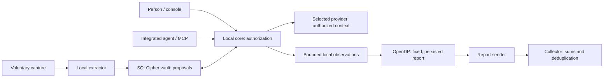

# OMNI-OS — Architecture of a Personal Context Authority

This document describes two distinct things: **the executable v1 in this repository** and **the target architecture** that can be built around its boundaries.
The labels **V1**, **Target**, and **Not guaranteed** are part of the specification; an intention must never be presented as an already demonstrated property.
Startup, platform, transport, and validation procedures remain in [README.md](README.md), [docs/PLATFORMS.md](docs/PLATFORMS.md), [docs/VPN.md](docs/VPN.md), and [docs/VALIDATION.md](docs/VALIDATION.md).
The [diagrams](DIAGRAMS.md) provide data flow and container views; the [roadmap](ROADMAP.md) sets the evidence required before each change.

## Navigation

- [1. Thesis and scope](#thesis)
- [2. Understanding and compression](#understanding)
- [3. Memory, provenance, and time](#memory)
- [4. Authority, agents, and revocation](#authority)
- [5. Data flows and trust boundaries](#data-flow)
- [6. TLS, interception, and network layers](#tls)
- [7. Keys, admission, and rotation](#keys)
- [8. Differential privacy contract](#dp)
- [9. Collector and uncertainty](#collector)
- [10. SingleStore and migration](#singlestore)
- [11. Private deployment and Kubernetes](#kubernetes)
- [12. Threats, validation, and evolution](#validation)

## 1. Thesis: continuity belongs to the person

OMNI aims to provide infrastructure where changing models no longer means rebuilding personal context, preferences, and the limits on their use.
This continuity rests on three capabilities: maintaining explainable memory, selecting useful context, and authorizing its transmission to a specific recipient.
Memory serves the person; agents and providers receive only a view tied to an interaction.

The “identity vector” is therefore a product metaphor, not the storage schema.
A single vector cannot adequately represent a change of employer, a temporary preference, contradictory sources, or a prohibition on disclosure.
The target architecture combines sources, temporal assertions, their relationships, and access policies; vector representations become derived indexes.

Authority here is a technical capability: deciding which reads and outputs may pass through OMNI.
It confers no power over an application that bypasses OMNI or a copy already received by a third party.
Nor does it turn an inference into truth, or possession of a document into a universal right to redistribute it.

| Area           | Delivered in v1                                                                               | Target or limitation                                           |
| -------------- | --------------------------------------------------------------------------------------------- | -------------------------------------------------------------- |
| Memory         | SQLCipher, sources, memories, statuses, history                                               | Temporal graph and derived semantic indexes                    |
| Understanding  | Extraction by a local model, proposals requiring confirmation                                 | Evaluated contradiction resolution and relevance               |
| Authorization  | Owner/agent tokens, grants by destination and scope                                           | Cryptographic identity and capabilities specific to each agent |
| Integrations   | OpenAI/Anthropic gateways, MCP, voluntary capture                                             | Additional connectors, without implicit universal interception |
| Request policy | Rust regex rules, text-file checks, size limits, revisioned local policy and managed baseline | No fleet control plane, binary parsing or response filter      |
| Administration | Persistent profiles/settings, model discovery, request journal, audit and usage               | No hidden observation of third-party website sessions          |
| Native runtime | Embedded Rust core, authenticated UI IPC, platform key-store adapters                         | Separate build/device/signing evidence for each target         |
| Transport      | WireGuard, authenticated admission, deployment tools                                          | Signed native distribution and large-scale operation           |
| Analytics      | Bounded OpenDP reports, Redis collector or local SQLite                                       | SingleStore analytics storage and publication governance       |
| Isolation      | Separate collector; memory and gateway in the same core                                       | Separate OS helpers with distinct network permissions          |
| ZK proofs      | None                                                                                          | Targeted verifiable attributes, if justified by a use case     |

The guided first run uses these same boundaries: catalog discovery, an optional confirmed local preference and a primary-provider choice. It creates no sharing grant and no inference request. Browser development startup uses an expiring one-time pairing capability; standalone native startup provisions an embedded session through a restricted main-window command. The transient UI session remains separate from provider authority. See the [first-run guide](docs/GETTING_STARTED.md).

The product must remain useful without participating in analytics or sending memory to a remote model.
Success is measured by the quality of tasks completed with controlled disclosure, not by the volume of data absorbed.

## 2. Understanding means selecting a representation for a task

### Useful compression and lost information

A personal summary is lossy compression: details are omitted, some relationships are simplified, and the choice of elements depends on the task.
OMNI claims neither lossless compression of a person's life nor reconstruction of their mental state.
Useful memory can retain a precise fact in ten words while keeping its full source to check what was omitted.

The target is a **context compiler**: a request, a recipient, and an authorization produce a minimal set of supported elements.
The compiler must explain what it selected, where it came from, why it appears relevant, and which restrictions excluded other elements.
The response model consumes this result; it does not decide for itself to expand read permissions.

Compression gains must be measured at comparable task quality: tokens transmitted, correction time, success, significant omissions, and unnecessary disclosures.
Reducing token count by removing an essential constraint is a failure, even if the summary looks elegant.
There is therefore no assumed percentage benefit from full device access: conversations alone, selected folders, and additional connectors are compared through ablation studies.

### Memory entropy is not a diagnosis of the person

In this architecture, “entropy” refers to a set of representation problems: duplicates, ambiguity, obsolescence, contradictions, and unsupported inferences.
The term does not correspond to a validated measure of intelligence, fatigue, or cognitive load.
Uncertainty about a memory must remain attached to that memory; it does not justify producing a global psychological profile.

Missing information remains unknown; the absence of a stated preference is neither refusal nor consent.
A new contradictory source triggers a proposed revision, not a silent replacement of history.
Repetition may indicate several independent sources or copies of the same error: provenance helps distinguish them.

**V1:** capture sends a bounded excerpt to the configured local model, then validates JSON output containing at most five proposals.
The model can neither confirm its proposals nor create grants; the interface lets the owner review them.
If the extractor is unavailable or its output is invalid, a source excerpt is retained with an explicit fallback status; successful understanding is never simulated.

**Target:** measure relevance, handle conflicts, separate personal and professional contexts, and rebuild indexes without altering sources.
Evaluation must include stale information, contradictory documents, malicious instructions in sources, and requests that require an “unknown” answer.

## 3. Traceable memory before a spectacular graph

### The objects actually persisted

**V1:** `sources` stores captured content, its type, metadata, and creation date.
`memories` contains text linked to a source, with creation/modification dates and a `proposed`, `confirmed`, `disputed`, or `superseded` status.
`memory_history` retains earlier versions when a memory is edited; `grants` and `receipts` describe authorizations and disclosures.
DP observations and analytics reports also remain local until an explicitly authorized release. A separate encrypted operational journal stores request metadata and audit events without conversation bodies or keys. Provider profiles, manual rate templates and console settings persist in the same vault. See [local administration](docs/ADMINISTRATION.md) for the actual schema and API.

Only confirmed memories can be injected into a provider's context.
MCP search is lexical; context selection is bounded and respects the grant's scope.
V1 has no semantic graph engine, persisted embeddings, or demonstrated automatic reconciliation of identities or contradictions.

The Nebula visualization represents available memory objects and their status; their positions are not a scientific map of the brain.
A particle animation is never evidence of an actual transfer or a verified tunnel.
The interface must show the absence of data or a connection when it has no such state available. **Models** distinguishes provider catalogs from Ollama models reported loaded. **History**, **Usage** and **Logs** show only OMNI-mediated activity. Unknown counters remain unknown; source-versus-context compression is a benchmark, not measured wire savings. Manual cost estimates are scoped to recorded usage and request-time rates.

### The target local graph

**Target:** a fact links a subject, a relation, and a value, with a source, assertion author, confidence, status, and access policy.
It distinguishes time in the world — “valid since June” — from the time of knowledge — “learned by OMNI in September.”
A stated preference, an observation, and an inference have different types; human confirmation does not erase their origin.

Relationships between people, projects, documents, and goals allow context to be retrieved without constructing a global profile that is routinely disclosed.
Sources remain the supporting evidence; summaries, embeddings, and caches are views that can become stale or be recomputed.
The provenance vocabulary can draw on the entities, activities, and agents of [W3C PROV-DM](https://www.w3.org/TR/prov-dm/); v1 does not claim a complete PROV implementation.

The graph retains dependencies: a synthesis must reference the facts and sources used to produce it.
Deleting a source must invalidate its derivatives; removing a fact while retaining its source requires a policy that prevents its automatic reintroduction.
The versions of the model, schema, and extraction procedure must be known so that changes can be explained.

### Deletion and reconstruction

**V1:** deleting a source deletes its associated memories and their history through relational cascades.
Deleting a single memory preserves its source if other memories reference it; the source is deleted when it becomes orphaned.
Receipts may retain historical identifiers without retaining the disclosed text.

SQLCipher protects the database at rest, but its content is necessarily decrypted in the memory of the process handling it.
Logical deletion, even with SQLite page cleaning, does not guarantee physical erasure from every SSD cell or external backup.
**Target:** an explicit backup policy, key rotation, deletion of derivatives, cache invalidation, and verified restores.

## 4. Local jurisdiction: what an agent can actually obtain

### Request policy is independent of memory permission

**V1:** `policy.rs` validates an owner-managed local policy stored in SQLCipher and an optional operator-provisioned baseline compiled at startup. The provider gateway prepares inspectable file blocks, resolves authorized memory, builds the final request, then applies both layers before creating a disclosure receipt or calling the provider. A decision is required even when interaction history is disabled. A policy failure does not silently retry without context or against a different model.

The launcher, Chat Completions and Messages gateways share this enforcement point. Capture checks the full source plus the extractor envelope before local inference or fallback persistence. MCP checks its query and granted result before returning memory. Local storage/editing and numeric analytics retain their separate contracts. Neither an owner credential nor a valid grant bypasses these request checks.

The local schema adds `request_policy` and a bounded `policy_decisions` metadata table. Changes use an expected revision; malformed policies are rejected atomically and corrupt stored rules never silently become defaults. The managed file is read once and must be protected with its launch environment. Its SHA-256 fingerprint identifies a configuration; it is not a signature or device attestation.

Only supported UTF-8 text attachments are inspectable. Regex matches decoded JSON string values and original file/memory text, not semantic intent. Response filtering, general binary parsing, trusted group identity and fleet provisioning are targets. [Policy contract and deployment requirements →](docs/POLICIES.md)

### Separating proposals, authorization, and execution

**V1:** the owner token administers memory and grants; the agent token cannot assign itself these administrative rights.
A grant specifies an exact provider base URL, a list of memory identifiers or a `*` scope, an expiration, and a revocation state.
The owner confirms memories and chooses the scope; the core checks the grant before transmitting context.

The `*` scope includes eligible confirmed memories at the time of the request; it is broader than a fixed selection of identifiers.
A v1 grant's lifetime is capped at twenty-four hours; without a grant, no memory is injected.
A request without memory can still contain the prompt its author deliberately entered.

MCP uses a separate destination, `https://omni.local/mcp`, for authorized reads.
The delivered tools search authorized memories or propose text for confirmation; they do not execute general system actions.
The v1 agent token is a shared integration secret: it is not yet a registry of distinct capabilities for each identified agent.

**Target:** each agent has a principal bound to a key; its capability specifies the recipient, resources, operations, expiration, quota, and any delegation rights.
The decision belongs to a deterministic policy evaluator; LLM-generated text never becomes an authorization.
A holder-bound capability, a nonce, and an explicit audience must prevent an authorization obtained for one task from being reused elsewhere.

### What revocation means

**V1:** revoking a grant blocks new reads and sends authorized by that grant within OMNI.
A check before transmission reduces the window between decision and sending; it cannot recall bytes already handed to the transport.
A receipt distinguishes authorization, an attempted send, and an error that may have left a partial transmission; it does not prove deletion at the recipient.

An honest interface distinguishes “access revoked,” “deletion requested,” and “deletion reported by the service.”
[OAuth token invalidation](https://www.rfc-editor.org/rfc/rfc7009) illustrates this boundary: terminating access does not retroactively delete data already obtained.
[ODRL](https://www.w3.org/TR/odrl-model/) policies can express permitted or prohibited uses; compliance outside OMNI requires a system that enforces them and verifiable controls.

### Selective assertions, ZK, and economic alignment

**Target:** when only one attribute is needed, provide a targeted attestation or proof instead of the entire personal memory.
Proof of age without a birth date is one possible case; its implementation depends on the cryptographic mechanism and an issuer accepted by the verifier.
[W3C Verifiable Credentials](https://www.w3.org/TR/vc-data-model-2.0/#zero-knowledge-proofs) describe this type of presentation without, by themselves, guaranteeing that every claim is true.

**V1: no ZK proof is produced.** Differential privacy for statistics is not a ZK proof, and a signature does not prove that actual interactions occurred.
The promise of personal authority also requires an economic policy: make visible any conflicts that could influence the choice of a model or service.
A user-paid subscription alone does not prove the absence of profile sales or commissions that bias recommendations.

## 5. Data flows and trust boundaries

This diagram represents responsibilities; its rectangles do not all denote isolated processes.
**V1:** the collector and local model runtime are separate from the core; the vault, decisions, and provider connector share the local Rust process.
Report types and modules make the flows auditable, but a Rust module is not an OS security boundary.

### Embedded native runtime and source development

The native Tauri application links the Rust core as a library and initializes its SQLCipher vault in the OS application-local-data directory under `vault-v1`. Platform code supplies the random database key from its native key-store adapter. Initialization uses explicit options, not process-environment defaults. Owner and restricted agent capabilities are generated per runtime session; the native bootstrap writes no development token or plaintext key files.

The native interface calls an owner-authenticated main-window IPC command. That command validates the token in constant time and dispatches a bounded local request into the same Axum router used by the external core. The packaged bootstrap starts **no HTTP listener**, collector or Node.js server. The reusable runtime supports an explicitly enabled ephemeral loopback listener for integrations, but that is a separate deployment choice. The native UI bridge collects a bounded response body; pass-through HTTP gateway streaming remains a separate transport contract.

An exclusive lease prevents two embedded runtimes from opening one vault directory and remains attached to the vault while active request references exist. Shutdown stops accepting new requests and drains or terminates an optional listener within a bounded interval. The interface lock clears its transient token, draft and conversation; it does not destroy the core's key, stop provider processing or perform OS authentication. Deliberately reopening the native interface is allowed on the current device session.

`run.sh` remains the external source-development workflow. It starts separate core, collector and UI services, and explicitly sets `OMNI_EXTERNAL_CORE=1` when opening its native window. That mode and simulation do not silently share or migrate a standalone app's vault. Desktop/mobile build targets, exact key stores and validation limits are specified in [PLATFORMS.md](docs/PLATFORMS.md). Mobile has no bundled local model, background interception daemon or system VPN extension.

| Actor                      | Information accessible during intended operation                              |
| -------------------------- | ----------------------------------------------------------------------------- |
| Unlocked local core        | Sources, authorized memories, prompts required for processing, observations   |
| Local extraction runtime   | Captured excerpt supplied to produce proposals                                |
| Selected remote provider   | Explicitly transmitted prompt and context; its own service metadata           |
| Production VPN/SOCKS relay | Connections, destinations, timing, and volumes; encrypted provider TLS stream |
| OMNI collector             | Noised reports, week, random report identifier, and transport metadata        |
| Reader of trends           | Published aggregates, report count, and stated uncertainty                    |

The analytics SaaS does not receive sources, prompts, responses, embeddings, or personal receipts through its ingestion protocol.
This protocol property does not mean that an operator sees no IP addresses or that a reverse proxy cannot log metadata.
An application gateway without centralized conversation history does not certify the provider's retention, cookies, user account, or internal practices.

**Target:** separate a vault worker with no network access, a provider connector receiving limited context, and a sender receiving only reports that have already been noised.
OS capabilities, restricted IPC, binary signatures, and traffic tests must establish these boundaries; they cannot be inferred from component names.
The threat model must include the update provider and compromised local software, not only a curious analytics server.

## 6. Network position: explicit application middleware

Language understanding belongs at the application layer: a message must be received in decrypted form by an authorized participant to be selected or enriched.
WireGuard transports packets; it does not provide access to the content of every HTTPS session it carries.
Moving down to L4, L3, or L2 changes transport control, not this cryptographic property.

**V1:** an application or agent deliberately configures OMNI as its OpenAI/Anthropic endpoint, or uses the console and MCP/capture tools.
The standalone native console uses authenticated in-process IPC. The console and external core communicate over loopback HTTP in the source-development workflow; no inbound TLS termination is claimed there. A native installation does not expose an integration port by default.
For a remote provider, the core opens a new HTTPS session and transmits the authorized context; redirects cannot silently change the destination.

In a future deployment with a local HTTPS entry point, that TLS connection will terminate at the OMNI gateway selected by the client, and a separate TLS connection will be established with the provider.
This is an explicitly configured application intermediary, not transparent capture of every application.
TLS confidentiality applies to the segments between their endpoints; the provider receiving the message can read it. See [TLS 1.3, RFC 8446](https://www.rfc-editor.org/rfc/rfc8446).

**Not delivered:** installation of a global certificate authority, universal transparent TLS interception, capture of keystrokes across all applications, or general semantic visibility into AI traffic.
A future general TLS MITM feature would require separate consent, a limited scope, secure certificate management, and explicit exclusions.
Certificate pinning, application protocols, QUIC, and closed applications must be treated as integration constraints; no promise of universal compatibility follows from them.

V1 configures a private SOCKS5h relay when the VPN is used: remote name resolution and the provider connection then follow that configured transport.
`OMNI_VPN_REQUIRED=true` without a proxy causes startup to fail; a remote proxy failure does not trigger a direct fallback connection.
Strictly loopback models use a separate local client; this path is an explicit exception for on-device inference.

## 7. Keys, admission, and rotation: three distinct mechanisms

The native vault key is random and 256 bits. Desktop adapters use macOS Keychain, Windows Credential Manager or Linux Secret Service. iOS uses an unsynchronized, device-only Keychain item available while unlocked; Android uses a non-exportable Keystore AES-GCM key to wrap the SQLCipher key in an authenticated encrypted envelope. Linux requires an available unlocked Secret Service session. Native startup has no development-file fallback and refuses to replace missing or corrupt key material for an existing vault.

The separate CLI/source-development path retains its macOS Keychain default and explicit file-key option; outside macOS its development default is a permissions-protected file. Simulation uses an isolated, clearly labeled development-file vault. These defaults do not describe installed native key custody.

No key is derived from the person's hardware or biometric fingerprint. V1 does not require biometric approval for every key read or claim universal Secure Enclave/StrongBox backing. The SQLCipher key exists in native memory during use. A copied database does not establish recoverability on another device, particularly with Android wrapping keys or iOS device-only items; no complete cross-device key recovery workflow is implemented.

WireGuard transport keys are separate from this storage key and from application tokens.
WireGuard uses a Noise-family protocol with session rekeying; it does not use IKE. [Official WireGuard description](https://www.wireguard.com/protocol/)
OMNI's client identity rotation is an additional policy, not a modification of WireGuard's native cryptographic exchange.

Admission uses an authenticated packet — Single Packet Authorization — with an HMAC, timestamp, nonce, and replay protection.
It reduces service exposure; it neither replaces WireGuard peer authentication nor consists of a simple secret sequence of port numbers.
Accepted nonces must be persisted before acknowledgment so that restarting does not allow them to be replayed.

The implemented policy provides for a new random identity every **1,800 seconds**, preparation, a handshake over the new path, an authenticated commit, and then a **30-second** overlap.
A timeout is never an acknowledgment; the old identity must expire on the server even if the client disappears.
Changing the internal address can interrupt a long TCP stream: a provider request already sent must not be replayed automatically as though it had never existed.

The privileged deployment tools and cryptographic simulation are not a signed macOS VPN extension distributed to users.
Tests accelerate the rotation policy clock; the encrypted packets and handshakes used in the laboratory are real.
Deployment conditions, administrative prerequisites, and validation boundaries are detailed in [the VPN guide](docs/VPN.md).

## 8. Differential privacy: a bounded guarantee

“Absolute privacy and global analytics” is not a coherent technical guarantee without specifying the adversaries, outputs, and accepted leakage.
Differential privacy bounds the effect of protected data on the probabilities of outcomes; it neither prevents every inference nor automatically conceals the network.
The protected unit and composition are essential; [NIST SP 800-226](https://csrc.nist.gov/pubs/sp/800/226/final) describes, among other pitfalls, overly weak units and repeated budgets.

### Implemented unit, mechanism, and composition

**V1:** a report summarizes observed local activity for one ISO week; replacing the entire history of that installation-week defines the adjacency considered here.
It contains three normalized histograms with eight bins each: topic, latency, and tokens; their dictionaries are fixed, with no free text.
The “inactive” and “other/unknown” bins avoid publishing a denominator or a list of categories that depends on private activity.

Topics come from an explicitly identified local heuristic; they are not validated psychological measurements.
Latency measures the wait until the provider's response headers; tokens come from returned usage when available, or otherwise fall into the unknown bin.
V1 does not infer frustration or cognitive load from typing tempo.

Each histogram is projected onto an exact binary grid with step `1/65536` and a sum of one; the remainder is assigned to the other/unknown bin.
For any two possible histograms `h` and `h'`, `||h - h'||₁ ≤ 2`: this bound does not depend on the number of interactions that week.
OpenDP applies a Laplace mechanism to a non-NaN vector, with scale **`b = 6.00000000000001`**; the small margin makes the numerical check of `ε ≤ 1/3` per group conservative.

Composing the three groups gives **`ε ≤ 1` per report**, with `δ = 0` for the chosen mechanism.
The pilot limits an installation to **four reports**, or **`ε ≤ 4`** by composition over the histories covered, provided its local ledger is preserved.
The mechanism is provided by [OpenDP](https://docs.opendp.org/en/stable/api/user-guide/measurements/additive-noise-mechanisms.html); the principles of sensitivity and composition are set out in [Dwork and Roth](https://www.cis.upenn.edu/~aaroth/Papers/privacybook.pdf).

### Persistence before disclosure

Consent is disabled by default; v1 prepares and sends a report on explicit action, with no automatic transmission schedule. The standalone native bootstrap supplies no collector, so enabling analytics, preparing a report or sending one is rejected before budget consumption until a deployment explicitly configures a destination.
The noised report is persisted transactionally before it is returned or sent; every retry for the same week reuses that report and its identifier.
Serialization preserves numeric values across reads: another network attempt does not generate a new noise sample.

Preparation consumes the budget even if the user ultimately does not send the report to the collector, because an output has already been produced for the console.
A report prepared during a week is a snapshot frozen at preparation; it is not recomputed with later interactions.
The budget resets neither at the start of a new week nor when consent is withdrawn and then restored.

**Not guaranteed:** a global per-person bound covering multiple devices, a destructive reinstall, restoration of an older ledger, or a modified client.
The documented guarantee applies to the values in the pilot's reports; the timing of the action, participation, failures, and IP address are not made private by this mechanism.
An activity-independent schedule, padding, and an independent relay would be separate work; [OHTTP, RFC 9458](https://www.rfc-editor.org/rfc/rfc9458), does not remove the need to analyze correlation and trust assumptions.

## 9. Collector: noised statistics and publication limits

The ingestion schema is closed: version, random report identifier, week, fixed epsilon, and three numeric arrays of eight elements.
Additional fields are rejected; there is no permitted field for a prompt or response in this contract.
The Rust sender constructs its request from the persisted report type, not from an arbitrary payload supplied by the browser.

**V1:** Redis is the intended production backend; SQLite is the local development and simulation backend.
Storage retains weekly sums and counts, plus deduplication identifiers and digests; it does not expose search over individual conversations.
The same identifier with the same content does not increment the aggregate twice; reusing that identifier with different content is a conflict.
The collector is therefore a stateful service: describing an LLM's response role as “stateless” removes neither the need for this ledger nor the need to analyze that provider's retention.

Production publication requires **at least 10,000 reports**, and this number refers to accepted reports, never verified distinct people.
With a scale close to six, the standard deviation of noise on a mean is approximately `6 × sqrt(2/n)`.
At `n = 10,000`, the pointwise 95% normal interval associated with this noise alone has a half-width of approximately **0.166**, or **16.6 percentage points**.

This interval covers neither recruitment bias, misclassification, nor fabricated reports; it is not a simultaneous interval for all twenty-four coordinates.
Noised values must not be individually clipped to `[0,1]` before aggregation: doing so would change the estimator.
A trend from the pilot remains an estimate about its voluntary participants, not a representative indicator of humanity.

V1 updates aggregates as reports arrive and broadcasts them over WebSocket once the threshold is met.
The difference between two successive states can reveal an already noised contribution; LDP protection remains, but the threshold does not guarantee that a reader can never reconstruct such a report.
**Target:** an explicit publication policy based on windows or batches, with analysis of differences between outputs and their actual utility.

DP protects the confidentiality of values within its model; it does not attest to their authenticity or solve Sybil attacks.
Rate limiting reduces some operational abuse without certifying a unique installation or a representative population.
Simulation uses separate stores and providers, displays its synthetic origin, and must never be aggregated with data from a real population.

## 10. SingleStore: an analytics target, never an implicit central vault

**Target, not implemented:** SingleStore could become the SQL backend for noised aggregates and their technical deduplication ledger.
This change moves neither sources, the personal graph, nor embeddings to the SaaS.
A need for faster analytics does not authorize a broader telemetry schema or joins with application identity.

The contract to preserve is “at most one counted contribution per report identifier,” with detection of conflicting reuse and an idempotent response after a timeout.
This contract describes the observable effect; exactly-once network delivery is not assumed.
An [INSERT operation with duplicate handling](https://docs.singlestore.com/cloud/reference/sql-reference/data-manipulation-language-dml/insert/) is one possible primitive, not proof of this distributed contract on its own.

Migration must version the schema, dictionaries, DP mechanism, and aggregation rules; two incompatible versions must not silently share a histogram.
A new adapter must validate deduplication and aggregation within one consistent operation, then return a deterministic status on retries.
Uniqueness keys, data distribution, and the transaction strategy must be tested on the SingleStore topology actually selected.
If [Pipelines into a procedure](https://docs.singlestore.com/cloud/reference/sql-reference/pipelines-commands/create-pipeline-into-procedure/) are used, their transaction management must be respected; the procedure must not add its own `BEGIN`/`COMMIT`.
A guarantee tied to a source offset does not deduplicate two identical HTTP requests ingested at different offsets: `report_id`, digest, and aggregate update remain an application contract that must be verified atomically.

The current stores do not retain every individual report: a migration must therefore be able to import existing aggregates and their deduplication digests without requiring conversations or a replay that is unavailable.
Cutover will use an identified cutoff point, comparison of counts/sums, duplicate validation, and rollback that preserves the same identifiers.
Archiving, ledger retention, and recovery after failure are part of the contract; deleting identifiers too early would allow old reports to be counted again.

## 11. Private deployment: “on-prem” does not mean “personal”

**Target, not delivered:** Kubernetes could orchestrate collectors, interfaces, and private authority services; no set of manifests currently delivers this offering in v1.
An enterprise-operated cluster has administrators, backups, secrets, and observability systems that form a different trust boundary from the person's device.
Moving a vault to that cluster is therefore more than a hosting optimization: it is a change in control that must be explained and authorized.

The personal and organizational planes must distinguish data owners, encryption keys, administrators, agent identities, and authorized recipients.
A tenant key must not implicitly unlock every personal vault; a request must not cross a tenant boundary merely because it knows an object identifier.
Remote inference on a private cluster receives plaintext when its model processes it: “on-prem” does not remove this disclosure.

Target requirements include minimally privileged service accounts, service identities, egress restrictions, separation of secrets, volumes, and backups, and tests across tenants.
A namespace will never be described as sufficient proof of isolation from a cluster administrator or a compromised node.
The deployment must publish who can decrypt, restore, update, and access logs; these answers come before the choice of charts or autoscaling.

## 12. Threats, required evidence, and order of evolution

| Threat                                   | V1 protection or current response                                             | Limitation that must remain visible                                                |
| ---------------------------------------- | ----------------------------------------------------------------------------- | ---------------------------------------------------------------------------------- |
| Reading the disk without a key           | SQLCipher, random key, native platform key store or explicit development file | The unlocked process sees plaintext; native device-bound keys need a recovery plan |
| An agent attempting to authorize itself  | Separate tokens; administrative routes reject the agent token                 | No identities/capabilities specific to each agent yet                              |
| Wrong destination or revoked grant       | Exact matching, expiration, checks before sending                             | No recall of data already disclosed                                                |
| Instructions embedded in a source        | Bounded extraction, proposals, authorization independent of the model         | The model can still propose an incorrect fact                                      |
| Exfiltration through compliant analytics | Closed schema, local OpenDP, persisted budget and outputs                     | Network metadata remains visible; compromised clients fall outside the guarantee   |
| Replaying reports or packets             | Analytics deduplication, SPA nonces, WireGuard protection                     | Backups and rollbacks must preserve ledgers                                        |
| Manipulated trends                       | Schema, rate limiting, separation of simulation and production                | Contribution authenticity is not proven                                            |
| Compromise of the OS or core             | Documented boundaries, limited local attack surface                           | Signed components with confinement and an independent audit are still required     |

Vault tests verify that the database is actually encrypted, that an incorrect key is rejected, and that related deletions and histories work.
Authorization tests check for canary leaks, recipients, scope, owner/agent separation, and revocation; network tests check preservation of provider stream bytes.
DP tests verify the schema, budget bound, persistence, and retries with the same noise; they complement rather than replace the mathematical analysis.

The multi-client laboratory uses synthetic data and machine checks; a visual demonstration does not replace assertions or result logs.
Deployment tests must distinguish local cryptographic transport, Linux interoperability, the privileged macOS path, signed distribution, and an operated public service.
The status of these validations is centralized in [docs/VALIDATION.md](docs/VALIDATION.md), rather than frozen into a general claim of production readiness.

The recommended order of evolution is: verified memory utility, per-agent capabilities, OS isolation, a traceable temporal graph, and then broader analytics only if its signal justifies collection.
SingleStore and Kubernetes address measured storage or operational needs; their presence alone adds neither understanding nor privacy.
The defining property remains verifiable at every step: **who knows what, from which source, for which task, with which authorization, and within which demonstrated limit**.
