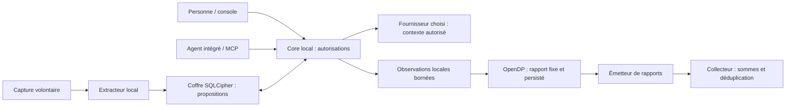

# OMNI-OS — Architecture d'une autorité personnelle de contexte

Ce document décrit deux objets distincts : **la v1 exécutable de ce dépôt** et **l'architecture cible** qui peut être construite à partir de ses frontières.
Les mentions **V1**, **Cible** et **Non garanti** font partie de la spécification ; une intention ne doit jamais être présentée comme une propriété déjà démontrée.
Les procédures de lancement, de transport et de validation restent dans [README.md](README.md), [docs/VPN.md](docs/VPN.md) et [docs/VALIDATION.md](docs/VALIDATION.md).
Les [schémas](DIAGRAMS.md) donnent les vues de flux et de conteneurs ; la [roadmap](ROADMAP.md) fixe les preuves nécessaires avant chaque évolution.

## Repères

- [1. Thèse et périmètre](#these)
- [2. Compréhension et compression](#comprehension)
- [3. Mémoire, provenance et temps](#memoire)
- [4. Autorité, agents et révocation](#autorite)
- [5. Flux et frontières de confiance](#flux)
- [6. TLS, interception et couches réseau](#tls)
- [7. Clés, admission et rotation](#cles)
- [8. Contrat de confidentialité différentielle](#dp)
- [9. Collecteur et incertitude](#collecteur)
- [10. SingleStore et migration](#singlestore)
- [11. Déploiement privé et Kubernetes](#kubernetes)
- [12. Menaces, validation et évolution](#validation)

## 1. Thèse : la continuité appartient à la personne

OMNI vise une infrastructure où changer de modèle ne signifie plus reconstruire son contexte personnel, ses préférences et les limites de leur utilisation.
La continuité recherchée tient dans trois capacités : conserver une mémoire explicable, sélectionner un contexte utile, puis autoriser sa transmission à un destinataire précis.
La mémoire sert la personne ; les agents et fournisseurs n'en reçoivent qu'une vue liée à une interaction.

Le « vecteur d'identité » est donc une métaphore de produit, pas le schéma de stockage.
Un vecteur unique ne représente correctement ni le changement d'employeur, ni une préférence temporaire, ni une contradiction entre sources, ni une interdiction de divulgation.
L'architecture cible combine des sources, des assertions temporelles, leurs relations et des politiques d'accès ; les représentations vectorielles deviennent des index dérivés.

L'autorité est ici une capacité technique : décider des lectures et sorties traversant OMNI.
Elle ne confère aucun pouvoir sur une application qui contourne OMNI, ni sur une copie déjà reçue par un tiers.
Elle ne transforme pas non plus une inférence en vérité, ou la possession d'un document en droit universel de le redistribuer.

| Domaine       | V1 livrée                                                   | Cible ou limite                                                      |
| ------------- | ----------------------------------------------------------- | -------------------------------------------------------------------- |
| Mémoire       | SQLCipher, sources, souvenirs, statuts, historique          | Graphe temporel et index sémantiques dérivés                         |
| Compréhension | Extraction par modèle local, propositions à confirmer       | Résolution de contradictions et pertinence évaluées                  |
| Autorisations | Jetons propriétaire/agent, grants par destination et portée | Identité cryptographique et capacités propres à chaque agent         |
| Intégrations  | Passerelles OpenAI/Anthropic, MCP, capture volontaire       | Connecteurs supplémentaires, sans interception universelle implicite |
| Transport     | WireGuard, admission authentifiée, outils de déploiement    | Distribution native signée et exploitation à grande échelle          |
| Analytique    | Rapports OpenDP bornés, collecteur Redis ou SQLite local    | Stockage analytique SingleStore et gouvernance des publications      |
| Isolation     | Collecteur séparé ; mémoire et passerelle dans le même core | Helpers OS séparés avec droits réseau distincts                      |
| Preuves ZK    | Aucune                                                      | Attributs vérifiables ciblés, si un cas d'usage le justifie          |

Le produit doit rester utile sans participer aux analytics et sans envoyer sa mémoire à un modèle distant.
Le succès ne se mesure pas au volume de données absorbées, mais à la qualité des tâches effectuées avec une divulgation maîtrisée.

## 2. Comprendre, c'est sélectionner une représentation pour une tâche

### Compression utile et information perdue

Un résumé personnel est une compression avec perte : des détails sont omis, certaines relations sont simplifiées et le choix des éléments dépend de la tâche.
OMNI ne revendique ni compression sans perte de la vie d'une personne, ni reconstruction de son état mental.
Une mémoire utile peut conserver un fait précis en dix mots et garder sa source complète pour vérifier ce qui a été omis.

La cible est un **compilateur de contexte** : une demande, un destinataire et une autorisation produisent un ensemble minimal d'éléments justifiés.
Le compilateur doit expliquer ce qu'il a sélectionné, d'où cela vient, pourquoi cela paraît pertinent et quelles restrictions ont écarté d'autres éléments.
Le modèle de réponse consomme ce résultat ; il ne décide pas lui-même d'élargir les droits de lecture.

Le gain de compression doit être mesuré à qualité de tâche comparable : tokens transmis, temps de correction, réussite, omissions importantes et divulgations inutiles.
Réduire le nombre de tokens en supprimant une contrainte essentielle constitue un échec, même si le résumé paraît élégant.
L'accès complet à l'appareil n'a donc aucun pourcentage de bénéfice présupposé : conversations seules, dossiers choisis puis connecteurs supplémentaires se comparent par ablation.

### L'entropie de la mémoire n'est pas un diagnostic humain

Dans cette architecture, « entropie » désigne un ensemble de problèmes de représentation : doublons, ambiguïtés, obsolescence, contradictions et inférences sans appui.
Ce terme ne correspond pas à un score validé d'intelligence, de fatigue ou de charge cognitive.
L'incertitude sur un souvenir doit rester attachée à ce souvenir ; elle ne justifie pas de produire un profil psychologique global.

Une information absente reste inconnue ; l'absence de mention d'une préférence ne vaut ni refus ni consentement.
Une nouvelle source contradictoire déclenche une proposition de révision, pas un remplacement silencieux de l'histoire.
Une répétition peut indiquer plusieurs sources indépendantes ou la copie d'une même erreur : la provenance sert à faire cette distinction.

**V1 :** la capture transmet un extrait borné au modèle local configuré, puis valide une sortie JSON contenant au maximum cinq propositions.
Le modèle ne peut ni confirmer ses propositions ni créer des grants ; l'interface permet au propriétaire de les examiner.
Si l'extracteur est indisponible ou sa sortie invalide, un extrait de source est conservé avec un statut explicite de repli ; aucune compréhension réussie n'est simulée.

**Cible :** mesurer la pertinence, gérer les conflits, segmenter les contextes personnels/professionnels et reconstruire les index sans altérer les sources.
L'évaluation doit inclure des informations périmées, des documents contradictoires, des instructions malveillantes dans les sources et des demandes pour lesquelles il faut répondre « inconnu ».

## 3. Une mémoire traçable avant un graphe spectaculaire

### Les objets réellement persistés

**V1 :** `sources` conserve le contenu capturé, son type, ses métadonnées et sa date de création.
`memories` contient des textes liés à une source, avec dates de création/modification et statut `proposed`, `confirmed`, `disputed` ou `superseded`.
`memory_history` conserve les versions antérieures lors d'une modification ; `grants` et `receipts` décrivent les autorisations et divulgations.
Les observations d'usage et rapports analytiques sont également locaux jusqu'à un export explicitement autorisé.

Seuls les souvenirs confirmés sont injectables dans le contexte d'un fournisseur.
La recherche MCP est lexicale ; la sélection de contexte est bornée et respecte la portée du grant.
La v1 n'a ni moteur de graphe sémantique, ni embeddings persistés, ni fusion automatique démontrée des identités ou des contradictions.

La visualisation Nebula représente les objets de mémoire disponibles et leur état ; ses positions ne constituent pas une cartographie scientifique du cerveau.
Une animation de particules n'est jamais une preuve qu'un transfert réel ou qu'un tunnel vérifié existe.
L'interface doit montrer l'absence de données ou de connexion lorsqu'elle ne dispose pas de cet état.

### Le graphe local cible

**Cible :** un fait relie un sujet, une relation et une valeur, avec source, auteur de l'assertion, confiance, statut et politique d'accès.
Il distingue le temps du monde — « valable depuis juin » — du temps de connaissance — « appris par OMNI en septembre ».
Une préférence déclarée, une observation et une inférence portent des types différents ; une confirmation humaine ne supprime pas leur origine.

Les relations entre personnes, projets, documents et objectifs permettent de retrouver un contexte sans construire une fiche globale systématiquement divulguée.
Les sources restent les pièces justificatives ; les résumés, embeddings et caches sont des vues qui peuvent être périmées ou recalculées.
Le vocabulaire de provenance peut s'inspirer des entités, activités et agents de [W3C PROV-DM](https://www.w3.org/TR/prov-dm/) ; aucune implémentation PROV complète n'est revendiquée pour la v1.

Le graphe conserve les dépendances : une synthèse doit référencer les faits et sources qui ont permis sa production.
Supprimer une source doit invalider les dérivés correspondants ; retirer un fait sans supprimer sa source exige une politique empêchant sa réintroduction automatique.
Les versions du modèle, du schéma et de la procédure d'extraction doivent être connues pour pouvoir expliquer une modification.

### Effacement et reconstruction

**V1 :** supprimer une source supprime les souvenirs associés et leur historique par cascades relationnelles.
Supprimer un seul souvenir conserve sa source si d'autres souvenirs la référencent ; la source est supprimée lorsqu'elle devient orpheline.
Les reçus peuvent conserver des identifiants historiques sans conserver le texte divulgué.

SQLCipher protège la base au repos, mais le contenu est nécessairement déchiffré dans la mémoire du processus qui le traite.
Une suppression logique, même avec nettoyage des pages SQLite, ne constitue pas une garantie d'effacement physique de toutes les cellules d'un SSD ou de sauvegardes externes.
**Cible :** politique explicite de sauvegarde, rotation des clés, suppression des dérivés, invalidation des caches et vérification des restaurations.

## 4. La juridiction locale : ce qu'un agent peut réellement obtenir

### Séparer proposer, autoriser et exécuter

**V1 :** le jeton propriétaire administre la mémoire et les grants ; le jeton agent ne peut pas s'attribuer ces droits administratifs.
Un grant désigne une base de fournisseur exacte, une liste d'identifiants de mémoire ou une portée `*`, une expiration et un état de révocation.
Le propriétaire confirme les souvenirs et choisit la portée ; le core vérifie le grant avant de transmettre le contexte.

La portée `*` inclut les souvenirs confirmés admissibles au moment de la demande ; elle est plus large qu'une sélection figée de quelques identifiants.
La durée d'un grant v1 est bornée à vingt-quatre heures ; l'absence de grant n'injecte aucune mémoire.
Une requête sans mémoire peut néanmoins contenir le prompt que son auteur a volontairement saisi.

MCP utilise une destination distincte, `https://omni.local/mcp`, pour ses lectures autorisées.
Les outils livrés recherchent des souvenirs autorisés ou proposent un texte à confirmer ; ils n'exécutent pas d'actions système générales.
Le jeton agent v1 est un secret d'intégration partagé : ce n'est pas encore un registre de capacités distinctes pour chaque agent identifié.

**Cible :** chaque agent possède un principal lié à une clé ; sa capacité précise destinataire, ressources, opérations, échéance, quota et droit éventuel de délégation.
La décision appartient à un évaluateur déterministe de politique ; un texte généré par un LLM ne devient jamais une autorisation.
Une capacité liée au détenteur, un nonce et une audience explicite doivent empêcher de réutiliser ailleurs une autorisation obtenue pour une autre tâche.

### Ce qu'une révocation signifie

**V1 :** révoquer un grant bloque les nouvelles lectures et les nouveaux envois autorisés par ce grant dans OMNI.
Une vérification avant l'émission réduit la fenêtre entre décision et envoi ; elle ne peut pas rappeler des octets déjà confiés au transport.
Un reçu distingue l'autorisation, l'envoi tenté et une erreur pouvant avoir laissé une transmission partielle ; il ne prouve pas l'effacement chez le destinataire.

Une interface honnête distingue « accès coupé », « suppression demandée » et « suppression déclarée par le service ».
L'[invalidation OAuth des jetons](https://www.rfc-editor.org/rfc/rfc7009) illustre cette frontière : arrêter une capacité d'accès n'efface pas rétroactivement les données obtenues.
Des politiques [ODRL](https://www.w3.org/TR/odrl-model/) peuvent exprimer des usages permis ou interdits ; leur respect extérieur nécessite un système qui les applique et des contrôles vérifiables.

### Assertions sélectives, ZK et alignement économique

**Cible :** lorsque seul un attribut est nécessaire, fournir une attestation ou une preuve ciblée plutôt que toute la mémoire personnelle.
Une preuve d'âge sans date de naissance est un cas possible ; sa réalisation dépend du mécanisme cryptographique et d'un émetteur accepté par le vérificateur.
Les [Verifiable Credentials W3C](https://www.w3.org/TR/vc-data-model-2.0/#zero-knowledge-proofs) décrivent ce type de présentation, sans garantir à elles seules la vérité de toute déclaration.

**V1 : aucune preuve ZK n'est produite.** La DP des statistiques n'est pas une preuve ZK et une signature ne prouve pas que des interactions réelles ont eu lieu.
La promesse d'autorité personnelle impose aussi une politique économique : rendre visibles les conflits qui pourraient influencer le choix d'un modèle ou d'un service.
Un abonnement payé par l'utilisateur ne suffit pas, à lui seul, à prouver l'absence de vente de profils ou de commissions biaisant les recommandations.

## 5. Flux de données et frontières de confiance

Ce diagramme représente les responsabilités ; ses rectangles ne signifient pas tous des processus isolés.
**V1 :** le collecteur et le runtime du modèle local sont séparés du core ; coffre, décisions et connecteur fournisseur partagent le processus Rust local.
Les types de rapport et modules rendent les flux auditables, mais un module Rust n'est pas une frontière de sécurité OS.

| Acteur                         | Informations accessibles dans le fonctionnement prévu                                   |
| ------------------------------ | --------------------------------------------------------------------------------------- |
| Core local déverrouillé        | Sources, souvenirs autorisés, prompts nécessaires au traitement, observations           |
| Runtime d'extraction local     | Extrait de capture remis pour produire des propositions                                 |
| Fournisseur distant choisi     | Prompt et contexte explicitement transmis ; métadonnées de son service                  |
| Relais VPN/SOCKS de production | Connexions, destinations, horaires et volumes ; flux TLS fournisseur chiffré            |
| Collecteur OMNI                | Rapports bruités, semaine, identifiant aléatoire de rapport et métadonnées de transport |
| Lecteur des tendances          | Agrégats publiés, effectif de rapports et incertitude annoncée                          |

Le SaaS analytique ne reçoit pas les sources, prompts, réponses, embeddings ou reçus personnels par son protocole d'ingestion.
Cette propriété du protocole ne signifie pas qu'un opérateur ne voit aucune IP, ni qu'un reverse proxy ne peut journaliser des métadonnées.
Une passerelle applicative sans historique de conversations central ne certifie pas la rétention du fournisseur, ses cookies, son compte utilisateur ou ses pratiques internes.

**Cible :** séparer un worker coffre sans réseau, un connecteur fournisseur recevant un contexte limité et un émetteur ne recevant que des rapports déjà bruités.
Les capacités OS, l'IPC fermé, les signatures des binaires et les tests de trafic devront établir ces frontières ; elles ne se déduisent pas du nom des composants.
Le modèle de menace doit inclure le fournisseur de mises à jour et le logiciel local compromis, pas seulement un serveur analytique curieux.

## 6. Position réseau : middleware applicatif explicite

La compréhension du langage appartient à la couche applicative : il faut recevoir un message déchiffré en tant que participant autorisé pour le sélectionner ou l'enrichir.
WireGuard transporte des paquets ; il ne donne pas accès au contenu de toutes les sessions HTTPS qu'il transporte.
Descendre vers L4, L3 ou L2 change le contrôle du transport, pas cette propriété cryptographique.

**V1 :** une application ou un agent configure volontairement OMNI comme endpoint OpenAI/Anthropic, ou utilise la console et les outils MCP/capture.
La console et le core communiquent en HTTP sur loopback dans le runtime de développement ; aucune terminaison TLS entrante n'y est prétendue.
Pour un fournisseur distant, le core ouvre une nouvelle session HTTPS et lui transmet le contexte autorisé ; les redirections ne peuvent pas changer silencieusement la destination.

Dans un futur déploiement doté d'une entrée HTTPS locale, cette connexion TLS se terminera sur la passerelle OMNI choisie par le client, puis une connexion TLS distincte partira vers le fournisseur.
Ce placement est celui d'un intermédiaire applicatif déclaré ; il n'est pas celui d'une capture transparente de toutes les applications.
La confidentialité TLS porte sur les segments entre leurs endpoints ; le fournisseur recevant le message peut le lire. Voir [TLS 1.3, RFC 8446](https://www.rfc-editor.org/rfc/rfc8446).

**Non livré :** installation d'une autorité de certification globale, interception TLS transparente universelle, capture des frappes de toutes les applications ou visibilité sémantique générale sur le trafic AI.
Une fonction future de MITM TLS général exigerait un consentement distinct, un périmètre limité, une gestion sûre des certificats et des exclusions explicites.
Le certificate pinning, les protocoles applicatifs, QUIC et les applications fermées doivent être traités comme des contraintes d'intégration ; aucune promesse de compatibilité universelle n'en découle.

La v1 configure un relais SOCKS5h privé lorsque le VPN est utilisé : la résolution distante et la connexion fournisseur suivent alors ce transport configuré.
`OMNI_VPN_REQUIRED=true` sans proxy provoque un refus de démarrage ; une panne du proxy distant ne déclenche pas de connexion directe de secours.
Les modèles strictement loopback utilisent un client local séparé ; ce chemin est une exception explicite pour l'inférence sur l'appareil.

## 7. Clés, admission et rotation : trois mécanismes distincts

La clé du coffre est aléatoire, de 256 bits, conservée par défaut dans le Keychain macOS. Hors macOS, la v1 utilise par défaut un fichier de développement protégé par permissions ; ce mode peut aussi être choisi explicitement sur macOS.
Elle n'est pas dérivée de l'empreinte matérielle ou biométrique de la personne.
La v1 ne prétend pas que chaque lecture de clé exige une authentification biométrique ni qu'elle possède une intégration Secure Enclave complète.

Les clés de transport WireGuard sont distinctes de cette clé de stockage et des jetons applicatifs.
WireGuard utilise un protocole de la famille Noise, avec ses renouvellements de session ; il n'utilise pas IKE. [Description officielle WireGuard](https://www.wireguard.com/protocol/)
La rotation OMNI de l'identité cliente est une politique supplémentaire, pas une modification de l'échange cryptographique natif de WireGuard.

L'admission utilise un paquet authentifié — Single Packet Authorization — avec HMAC, horodatage, nonce et protection contre le rejeu.
Elle réduit l'exposition du service ; elle ne remplace pas l'authentification du pair WireGuard et n'est pas une simple séquence secrète de numéros de ports.
La persistance des nonces acceptés avant accusé de réception est nécessaire pour que le redémarrage ne réautorise pas leur rejeu.

La politique implémentée prévoit une nouvelle identité aléatoire toutes les **1 800 secondes**, préparation, handshake sur le nouveau chemin, commit authentifié, puis chevauchement de **30 secondes**.
Un timeout ne vaut jamais accusé de réception ; l'ancienne identité doit expirer côté serveur même si le client disparaît.
Le changement d'adresse interne peut interrompre un flux TCP long : une requête fournisseur déjà partie ne doit pas être rejouée automatiquement comme si elle n'avait jamais existé.

Les outils de déploiement privilégiés et la simulation cryptographique ne sont pas une extension VPN macOS signée et distribuée aux utilisateurs.
Les tests accélèrent l'horloge de la politique de rotation ; les paquets chiffrés et handshakes utilisés dans le laboratoire sont réels.
Les conditions de déploiement, prérequis administratifs et frontières de validation sont précisées dans [le guide VPN](docs/VPN.md).

## 8. Confidentialité différentielle : un contrat fini, pas une impossibilité absolue

« Privacy absolue et analytique globale » n'est pas une garantie technique cohérente sans préciser les adversaires, les sorties et la fuite acceptée.
La confidentialité différentielle borne l'effet des données protégées sur les probabilités des résultats ; elle n'interdit pas toute inférence et ne cache pas automatiquement le réseau.
Le choix de l'unité protégée et la composition sont essentiels ; le [NIST SP 800-226](https://csrc.nist.gov/pubs/sp/800/226/final) décrit notamment les pièges des unités trop faibles et des budgets répétés.

### Unité, mécanisme et composition implémentés

**V1 :** un rapport résume l'activité locale observée pour une semaine ISO ; remplacer tout l'historique de cette installation-semaine constitue l'adjacence considérée.
Il comporte trois histogrammes normalisés de huit cases : sujet, latence et tokens ; leurs dictionnaires sont fixes, sans texte libre.
Les cases « inactif » et « autre/inconnu » évitent de publier un dénominateur ou une liste de catégories dépendant de l'activité privée.

Les sujets sont issus d'une heuristique locale explicitement identifiée ; ils ne sont pas des mesures psychologiques validées.
La latence mesure l'attente jusqu'aux en-têtes du fournisseur ; les tokens proviennent de l'usage retourné lorsque disponible, sinon de la case inconnue.
La v1 ne déduit ni frustration ni charge cognitive du tempo de frappe.

Chaque histogramme est projeté sur une grille binaire exacte de pas `1/65536`, avec une somme égale à un ; le résidu est affecté à la case autre/inconnu.
Pour deux histogrammes possibles `h` et `h'`, `||h - h'||₁ ≤ 2` : cette borne ne dépend pas du nombre d'interactions de la semaine.
OpenDP applique un mécanisme Laplace sur vecteur non-NaN, avec échelle **`b = 6.00000000000001`** ; la légère marge rend conservatrice la vérification numérique de `ε ≤ 1/3` par groupe.

La composition des trois groupes donne **`ε ≤ 1` par rapport**, avec `δ = 0` pour le mécanisme retenu.
Le pilote limite une installation à **quatre rapports**, soit **`ε ≤ 4`** par composition sur les historiques couverts, sous conservation de son registre local.
Le mécanisme est celui d'[OpenDP](https://docs.opendp.org/en/stable/api/user-guide/measurements/additive-noise-mechanisms.html) ; les principes de sensibilité et composition sont exposés dans [Dwork et Roth](https://www.cis.upenn.edu/~aaroth/Papers/privacybook.pdf).

### Persistance avant divulgation

Le consentement est désactivé par défaut ; la v1 prépare et envoie un rapport sur action explicite, sans cadence automatique d'émission.
Le rapport bruité est persisté transactionnellement avant d'être retourné ou envoyé ; toute reprise pour la même semaine réutilise ce rapport et son identifiant.
La sérialisation conserve les valeurs numériques entre lectures : une nouvelle tentative réseau ne génère pas un nouvel échantillon de bruit.

La préparation consomme le budget, même si l'utilisateur n'envoie finalement pas le rapport au collecteur, puisqu'une sortie a déjà été produite pour la console.
Un rapport préparé en cours de semaine est un instantané arrêté à sa préparation ; il n'est pas recalculé avec les interactions ultérieures.
Le budget ne se réinitialise ni au changement de semaine, ni lors d'un retrait puis rétablissement du consentement.

**Non garanti :** une borne globale par personne couvrant plusieurs appareils, une réinstallation destructive, une restauration ancienne du registre ou un client modifié.
La garantie documentée porte sur les valeurs des rapports du pilote ; l'heure de l'action, la participation, les pannes et l'adresse IP ne sont pas rendues privées par ce mécanisme.
Une cadence indépendante de l'activité, du padding et un relais indépendant seraient des travaux distincts ; [OHTTP, RFC 9458](https://www.rfc-editor.org/rfc/rfc9458), ne dispense pas d'analyser corrélation et hypothèses de confiance.

## 9. Collecteur : statistiques bruitées et limites de publication

Le schéma reçu est fermé : version, identifiant aléatoire de rapport, semaine, epsilon fixé et trois tableaux numériques de huit éléments.
Les champs supplémentaires sont refusés ; un prompt ou une réponse n'a aucun emplacement autorisé dans le contrat.
L'émetteur Rust construit sa requête à partir du type de rapport persisté, et non d'un payload arbitraire fourni par le navigateur.

**V1 :** Redis est le backend prévu en production ; SQLite est le backend local de développement et de simulation.
Le stockage conserve des sommes et effectifs par semaine, plus identifiants et empreintes de déduplication ; il n'expose pas une recherche dans des conversations individuelles.
Un même identifiant avec le même contenu n'incrémente pas deux fois l'agrégat ; le réemploi de cet identifiant avec un contenu différent est un conflit.
Le collecteur est donc un service avec état : qualifier le rôle de réponse d'un LLM de « stateless » ne dispense ni de ce registre ni d'une analyse de rétention chez ce fournisseur.

La publication de production exige **au moins 10 000 rapports**, et ce nombre désigne des rapports acceptés, jamais des personnes distinctes vérifiées.
Avec une échelle voisine de six, l'écart-type du bruit sur une moyenne vaut approximativement `6 × sqrt(2/n)`.
À `n = 10 000`, l'intervalle normal ponctuel à 95 % associé à ce bruit seul a une demi-largeur d'environ **0,166**, soit **16,6 points de pourcentage**.

Cet intervalle ne couvre ni biais de recrutement, ni classification erronée, ni rapports fabriqués ; il n'est pas un intervalle simultané pour les vingt-quatre coordonnées.
Les valeurs bruitées ne doivent pas être tronquées individuellement dans `[0,1]` avant agrégation : cela modifierait l'estimateur.
Une tendance issue du pilote reste une estimation sur ses participants volontaires, pas un indicateur représentatif de l'humanité.

La v1 actualise les agrégats au fil des rapports et les diffuse par WebSocket lorsque le seuil est atteint.
La différence entre deux états successifs peut révéler une contribution déjà bruitée ; la protection LDP demeure, mais le seuil ne garantit pas qu'un lecteur ne reconstitue jamais un tel rapport.
**Cible :** une politique de publications par fenêtres ou lots explicites, avec analyse des différences entre sorties et de leur utilité réelle.

La DP protège la confidentialité des valeurs dans son modèle ; elle n'atteste pas leur authenticité et ne résout pas les attaques Sybil.
La limitation de débit réduit certains abus opérationnels sans certifier une installation unique ni une population représentative.
La simulation utilise des stores et fournisseurs séparés, affiche son origine synthétique et ne doit jamais être agrégée aux données d'une population réelle.

## 10. SingleStore : cible analytique, jamais coffre central implicite

**Cible, non implémentée :** SingleStore peut devenir le backend SQL des agrégats bruités et de leur registre technique de déduplication.
Ce changement ne déplace ni les sources, ni le graphe personnel, ni les embeddings sur le SaaS.
Un besoin d'analytique plus rapide n'autorise pas à élargir le schéma de télémétrie ou à produire des jointures avec l'identité applicative.

Le contrat à préserver est « au plus une contribution comptée par identifiant de rapport », avec détection des réemplois conflictuels et réponse idempotente après un timeout.
Ce contrat décrit l'effet observable ; une livraison réseau exactement une fois n'est pas présumée.
Une [opération INSERT/gestion des doublons](https://docs.singlestore.com/cloud/reference/sql-reference/data-manipulation-language-dml/insert/) est une primitive possible, pas une preuve à elle seule de ce contrat distribué.

La migration devra versionner schéma, dictionnaires, mécanisme DP et règles d'agrégation ; deux versions incompatibles ne partagent pas silencieusement un histogramme.
Un nouvel adaptateur devra valider dans une même opération cohérente déduplication et agrégation, puis restituer un statut déterministe aux reprises.
Les clés d'unicité, la répartition des données et la stratégie transactionnelle devront être testées sur la topologie SingleStore réellement retenue.
Si des [Pipelines vers une procédure](https://docs.singlestore.com/cloud/reference/sql-reference/pipelines-commands/create-pipeline-into-procedure/) sont utilisés, leur gestion des transactions doit être respectée ; la procédure ne doit pas ajouter ses propres `BEGIN`/`COMMIT`.
La garantie portant sur un offset de source ne déduplique pas deux requêtes HTTP identiques entrées à des offsets différents : `report_id`, empreinte et modification d'agrégat restent un contrat applicatif à vérifier atomiquement.

Les stores actuels ne conservent pas tous les rapports individuels : une migration doit donc pouvoir importer les agrégats existants et leurs empreintes de déduplication, sans exiger des conversations ni un rejeu inexistant.
Le basculement utilisera un point de coupure identifié, comparaison des effectifs/sommes, validation des doublons et retour arrière conservant les mêmes identifiants.
L'archivage, la rétention du registre et les reprises après panne font partie du contrat ; effacer les identifiants trop tôt permettrait de recompter d'anciens rapports.

## 11. Déploiement privé : « on-prem » ne signifie pas « personnel »

**Cible, non livrée :** Kubernetes peut orchestrer collecteurs, interfaces et services d'autorité privés ; aucun ensemble de manifests ne constitue actuellement cette offre dans la v1.
Un cluster exploité par une entreprise possède des administrateurs, sauvegardes, secrets et observabilités qui forment une frontière de confiance différente de l'appareil de la personne.
Déplacer un coffre sur ce cluster n'est donc pas une simple optimisation d'hébergement : c'est un changement de contrôle à expliquer et autoriser.

Le plan personnel et le plan organisationnel doivent distinguer propriétaires des données, clés de chiffrement, administrateurs, identités d'agents et destinataires autorisés.
Une clé de tenant ne doit pas ouvrir implicitement tous les coffres personnels ; une requête ne doit pas traverser une frontière de tenant parce qu'elle connaît un identifiant d'objet.
L'inférence distante sur un cluster privé reçoit du clair lorsque son modèle le traite : « on-prem » ne supprime pas cette divulgation.

Les exigences cibles comprennent service accounts minimaux, identités de service, restrictions d'egress, séparation des secrets, volumes et sauvegardes, et tests inter-tenants.
Un namespace ne sera jamais décrit comme une preuve suffisante d'isolation face à l'administrateur du cluster ou à un nœud compromis.
Le déploiement devra publier qui peut déchiffrer, restaurer, mettre à jour et accéder aux journaux ; ces réponses précèdent le choix des charts ou de l'autoscaling.

## 12. Menaces, preuves attendues et ordre d'évolution

| Menace                                | Protection v1 ou réponse actuelle                                    | Limite à conserver visible                                   |
| ------------------------------------- | -------------------------------------------------------------------- | ------------------------------------------------------------ |
| Lecture du disque sans clé            | SQLCipher, clé aléatoire, Keychain ou permissions de développement   | Le processus déverrouillé voit le clair                      |
| Agent voulant s'autoriser lui-même    | Jetons séparés, routes administratives interdites au jeton agent     | Pas encore d'identités/capacités propres à chaque agent      |
| Mauvaise destination ou grant révoqué | Comparaison exacte, expiration, vérification avant envoi             | Aucune reprise de données déjà divulguées                    |
| Source contenant des instructions     | Extraction bornée, propositions, autorisation indépendante du modèle | Le modèle peut toujours proposer un fait erroné              |
| Exfiltration par analytics conforme   | Schéma fermé, OpenDP local, budget et sorties persistés              | Métadonnées réseau visibles ; client compromis hors garantie |
| Rejeu de rapports ou de paquets       | Déduplication analytique, nonces SPA, protection WireGuard           | Sauvegardes/retours arrière doivent préserver les registres  |
| Tendances manipulées                  | Schéma, débit limité, distinction simulation/production              | Authenticité des contributions non prouvée                   |
| Compromission de l'OS ou du core      | Frontières documentées, surface locale limitée                       | Confinement signé et audit indépendant encore nécessaires    |

Les tests du coffre vérifient une base effectivement chiffrée, le refus d'une mauvaise clé, les suppressions liées et les historiques.
Les tests d'autorisation vérifient fuite de canaris, destinataires, portée, séparation propriétaire/agent et révocation ; les tests réseau conservent les octets des flux fournisseurs.
Les tests DP vérifient schéma, borne de budget, persistance et reprise du même bruit ; ils complètent l'analyse mathématique sans la remplacer.

Le laboratoire multi-client utilise des données synthétiques et des vérifications machine ; une démonstration visuelle ne remplace pas les assertions ni les journaux de résultats.
Les essais de déploiement doivent distinguer transport cryptographique local, interopérabilité Linux, chemin macOS privilégié, distribution signée et service public exploité.
L'état de ces validations est centralisé dans [docs/VALIDATION.md](docs/VALIDATION.md), plutôt que figé dans une promesse générale de production.

L'ordre d'évolution recommandé est : utilité de la mémoire vérifiée, capacités par agent, isolation OS, graphe temporel traçable, puis analytique élargie seulement si son signal justifie sa collecte.
SingleStore et Kubernetes viennent répondre à des besoins de stockage ou d'exploitation mesurés ; ils n'ajoutent pas, par leur seule présence, de compréhension ou de confidentialité.
La propriété structurante reste vérifiable à chaque étape : **qui sait quoi, sur quelle source, pour quelle tâche, avec quelle autorisation et sous quelle limite démontrée**.
