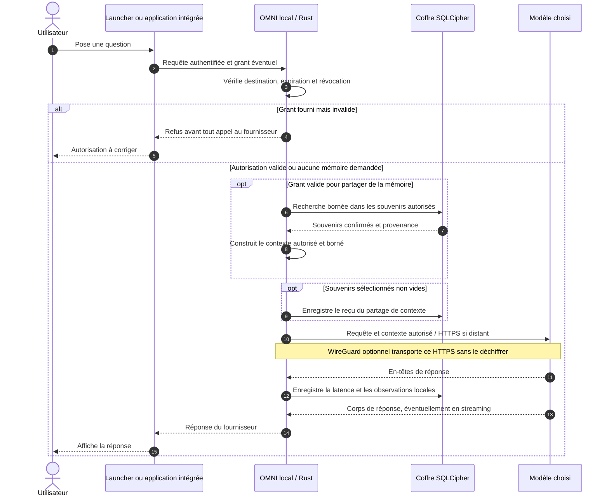
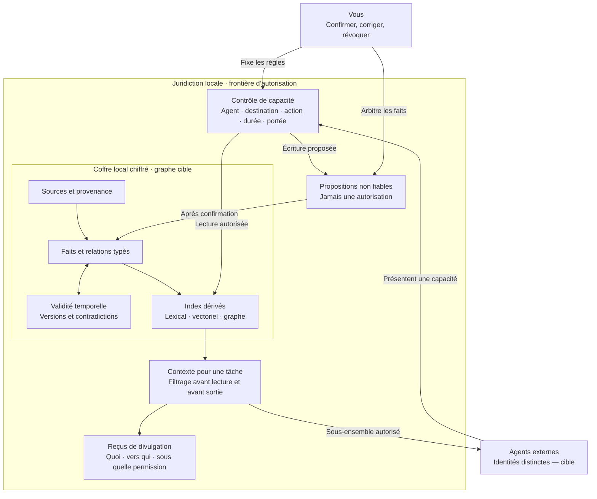
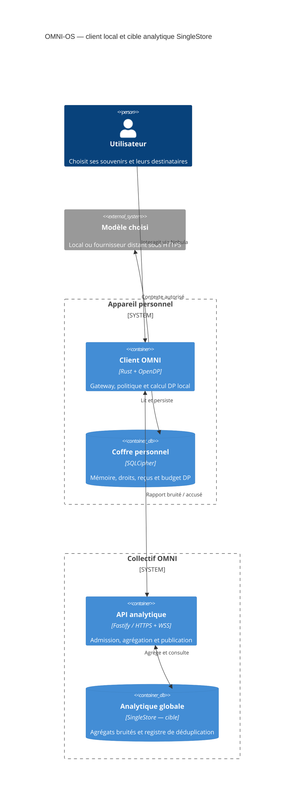
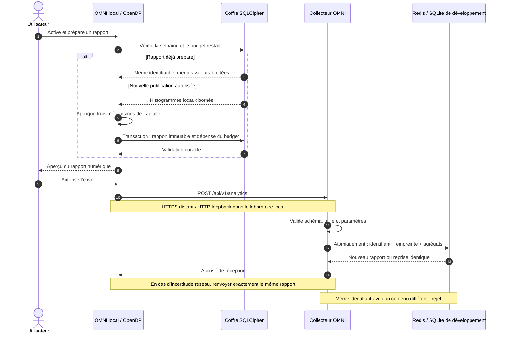
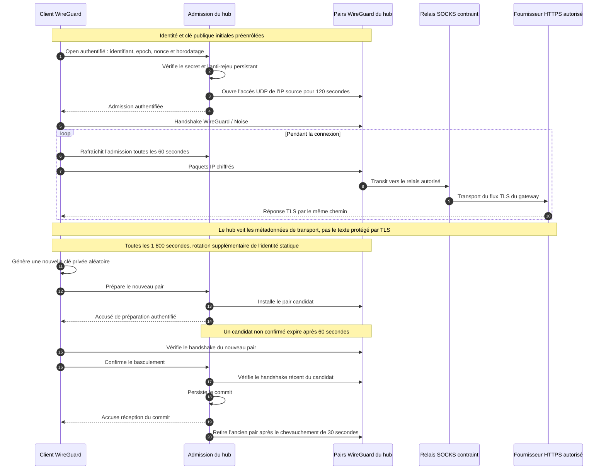

# OMNI-OS · Les frontières de la compréhension

> Un schéma doit montrer ce qui peut traverser une frontière — et qui en décide.

Ces vues complètent le [livre d’architecture](ARCHITECTURE.md). **Implémenté** désigne le comportement du dépôt. **Cible** désigne une construction à livrer, avec ses critères dans la [roadmap](ROADMAP.md). Une frontière dessinée ne constitue jamais, à elle seule, une isolation imposée par le système d’exploitation.

## 1. Une requête, une autorisation, une réponse

**Implémenté — intégration applicative explicite.** L’application ou l’agent appelle le gateway OMNI. Le VPN ne découvre pas le texte d’une conversation HTTPS. Mémoire, politique et gateway sont actuellement des modules du même processus Rust.

La conversation ne part pas vers le collecteur OMNI. Le **fournisseur choisi** reçoit nécessairement le texte autorisé pour effectuer son calcul. Son éventuelle rétention dépend de son contrat et de sa configuration. Le mode local garde ce calcul sur l’appareil.

Une entrée de mémoire issue d’une capture reste une **proposition** jusqu’à confirmation. Le reçu trace une divulgation tentée par OMNI ; il ne prouve pas qu’un fournisseur a effacé ses copies ni qu’il a correctement utilisé chaque souvenir.

Le gateway sélectionne les souvenirs confirmés permis, dans la limite de 24 entrées et 12 000 octets ; cette sélection n’effectue pas encore une recherche sémantique liée à la question. La recherche lexicale avec une requête existe côté MCP. Les observations ne constituent pas un archivage automatique de la conversation ; les tokens d’un flux streaming restent inconnus.

## 2. Le terrain qui se métamorphose

**Cible — Knowledge Graph temporel et autorité par agent.** La v1 possède déjà des sources, souvenirs, états, historiques, permissions et reçus. Sa recherche est lexicale ; les relations sémantiques ci-dessous et les identités cryptographiques distinctes par agent restent à construire.

**Zero Trust signifie vérifier chaque requête.** Un agent n’obtient jamais un accès SQL direct au coffre. Une instruction trouvée dans un document reste une donnée : elle ne peut étendre une permission. La cible sépare aussi le coffre et les sorties réseau par des mécanismes de l’OS ; ce confinement n’est pas une propriété déjà démontrée du processus Rust actuel.

Le graphe conserve les désaccords et les dates. Les index accélèrent la recherche ; ils ne deviennent pas la source de vérité. Une correction doit invalider les vues dérivées concernées. Un dessin de Nebula n’est pas la preuve qu’une relation a été inférée correctement.

## 3. L’écosystème : deux destinations, deux contrats

**Cible analytique — modèle C4 de conteneurs.** Ici, « conteneur » désigne une unité exécutable ou un stockage au sens de C4 ; il ne signifie pas que tout doit tourner dans Docker. Cette vue conserve le client Rust v1 et montre l’évolution du backend vers SingleStore. **Aujourd’hui, le collecteur Fastify emploie Redis en production, SQLite en développement.** L’isolation future des modules locaux en processus séparés est détaillée dans l’[architecture](ARCHITECTURE.md).

Le SaaS LLM apporte un service de calcul. Le SaaS OMNI tient un état statistique durable. **Aucun des deux ne possède, par cette architecture, le rôle de mémoire personnelle faisant autorité.** Appeler un modèle comme un moteur sans état ne garantit pas l’absence de journaux chez son fournisseur.

Cette vue se concentre sur le traitement et le stockage. Nebula interroge aussi l’API analytique et reçoit ses publications en WebSocket : uniquement les tendances ayant franchi le seuil prévu, avec leur incertitude.

SingleStore ne recevrait que des rapports déjà bruités et des données techniques minimales d’ingestion. Une transaction doit relier déduplication et mise à jour de l’agrégat. Si une file durable et un pipeline sont ajoutés, leurs garanties ne suffiront pas à empêcher deux requêtes HTTP identiques d’être comptées deux fois à deux positions différentes du journal. Dans la cible d’isolation locale, l’émetteur réseau ne reçoit que le rapport déjà bruité ; il n’accède pas directement à la base personnelle.

La syntaxe C4 de Mermaid est [expérimentale](https://mermaid.js.org/syntax/c4). Le bloc ci-dessus est testé avec Mermaid CLI 11.17.0 ; la version embarquée par GitHub peut différer. Les autres vues utilisent les diagrammes de séquence et les graphes standards.

## 4. Une statistique ne doit dépenser son budget qu’une fois

**Implémenté — rapport hebdomadaire préparé explicitement, export volontaire.** L’analytique est désactivée par défaut hors simulation. Le serveur accepte uniquement le schéma numérique fermé prévu ; aucune propriété libre n’accueille une conversation.

Trois histogrammes normalisés, huit cases chacun : sujets, latence, tokens. Pour chacun, la sensibilité L1 est bornée par 2 ; le budget est de ε = 1/3. Le rapport compose donc **ε = 1**. La v1 limite le pilote à **quatre rapports par installation**, soit ε ≤ 4 pour ce registre conservé. Le bruit de Laplace a une échelle légèrement supérieure à 6 pour tenir compte de l’implémentation numérique.

Ce mécanisme borne la variation de distribution lorsqu’on remplace les données d’une installation pour une semaine. Il ne cache ni l’adresse IP ni la participation. Le seuil de production est exprimé en **rapports**, pas en personnes distinctes. Réinstallation, copies divergentes du coffre et plusieurs appareils ne doivent pas être présentés comme un budget personnel global déjà résolu. [Garanties et calculs →](docs/PRIVACY.md)

## 5. Le tunnel protège le transport

**Implémenté — knocking authentifié et rotation des identités WireGuard.** Le knocking est une autorisation d’admission à durée courte, signée par HMAC avec nonce et horodatage ; le simple ordre de quelques ports ouverts ne constitue pas une authentification.

**WireGuard utilise Noise ; IKE appartient à IPsec.** La rotation des clés d’identité toutes les trente minutes s’ajoute au renouvellement automatique des clés de session WireGuard. Elle n’est pas un mode IKE. Le changement d’adresse interne pendant le basculement peut interrompre une connexion TCP ; une reprise applicative reste nécessaire.

L’interopérabilité BoringTun ↔ WireGuard Linux, l’admission, la rotation et le rejet de l’ancienne clé ont été testés. La simulation locale n’installe aucune route privilégiée. Le superviseur `utun` macOS demande un lancement privilégié distinct, dont le chemin complet reste à valider sur machine cible. [Déploiement, serveurs et secrets →](docs/VPN.md)

## Lire les flèches sans se raconter d’histoire

| Flèche                 | Ce qui la traverse                           | Ce qu’elle ne prouve pas                                                    |
| ---------------------- | -------------------------------------------- | --------------------------------------------------------------------------- |
| Mémoire → gateway      | Un contexte sélectionné sous permission      | Une compréhension infaillible de la personne                                |
| Gateway → LLM distant  | Le prompt et le contexte autorisé, sous TLS  | L’absence de conservation chez le fournisseur                               |
| Exporteur → collecteur | Un rapport numérique déjà bruité             | L’anonymat réseau ou l’unicité humaine                                      |
| Collecteur → interface | Des agrégats publiables avec leurs limites   | Une mesure clinique, une opinion universelle ou une vérité sans incertitude |
| Client VPN → hub       | Un transport chiffré et une identité de pair | Une interception sémantique universelle des applications                    |

[Retour au README](README.md) · [Architecture](ARCHITECTURE.md) · [Roadmap](ROADMAP.md)
