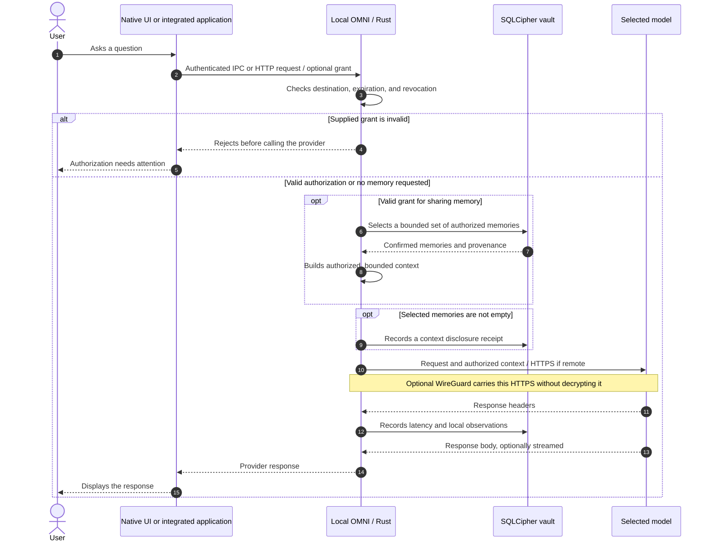
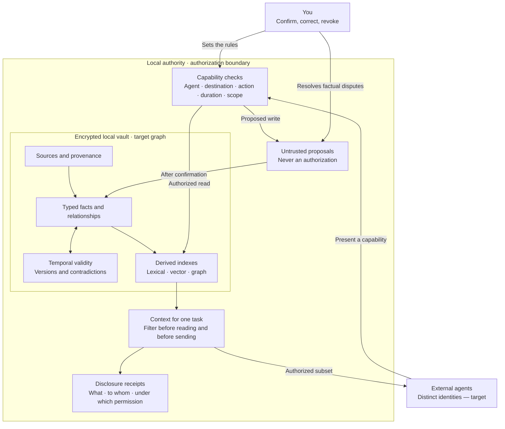
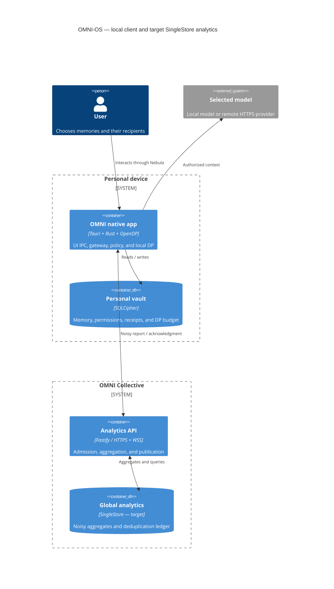
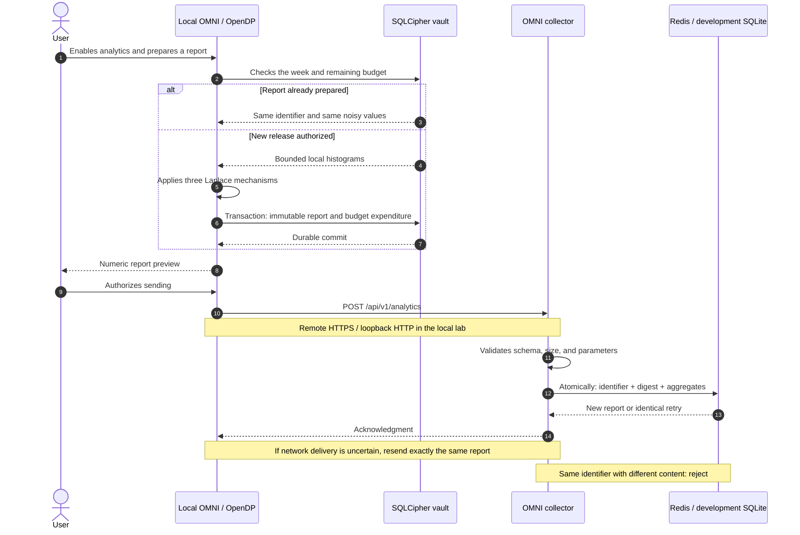
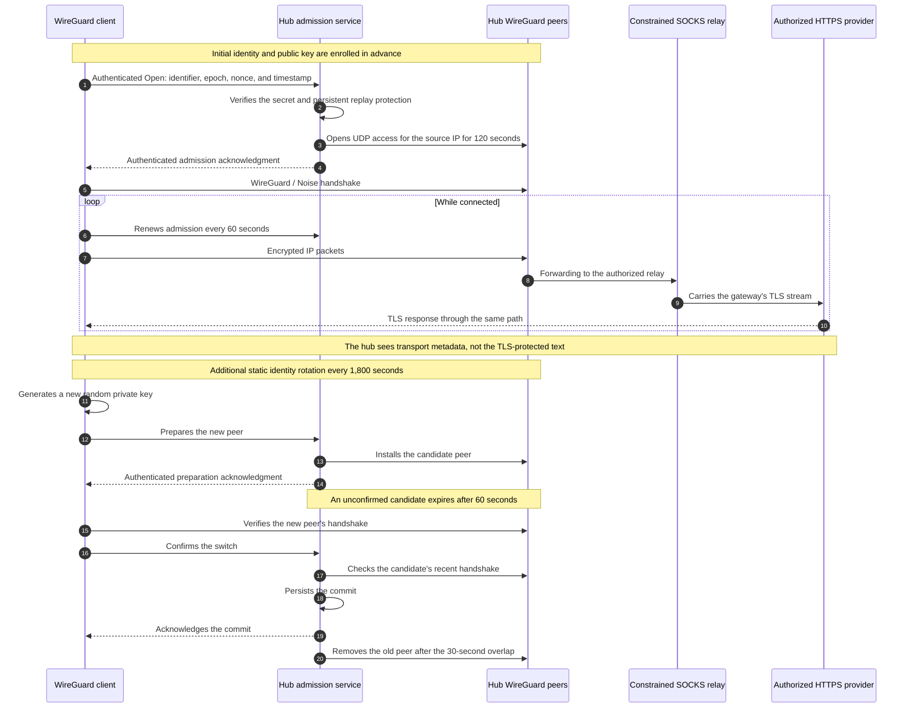

# OMNI-OS · The Boundaries of Understanding

> A diagram should show what can cross a boundary—and who decides.

These views complement the [architecture guide](ARCHITECTURE.md). **Implemented** describes behavior in this repository. **Target** describes work still to be delivered, with acceptance criteria in the [roadmap](ROADMAP.md). A boundary drawn on a diagram is never, by itself, evidence of operating-system isolation.

## 1. One request, one authorization, one response

**Implemented — explicit application integration.** The native UI reaches its embedded core through authenticated IPC. An application or agent can instead call an explicitly exposed HTTP gateway. The VPN does not reveal the text of an HTTPS conversation. Memory, policy, and the gateway run as modules within the same Rust process, embedded in the native application when that mode is used.

The conversation is not sent to the OMNI collector. The **selected provider** necessarily receives the authorized text to perform its computation. Any retention depends on that provider's contract and configuration. Local mode keeps this computation on the device.

A memory extracted from a capture remains a **proposal** until confirmed. A receipt records an attempted disclosure by OMNI; it does not prove that a provider deleted its copies or used each memory correctly.

The gateway selects authorized, confirmed memories, up to 24 entries and 12,000 bytes. This selection does not yet perform semantic retrieval based on the question. Query-based lexical search is available through MCP. Observations do not automatically archive the conversation. Supported stream events contribute token counters when present; missing counters remain unknown. The native UI bridge returns a bounded complete body, while the external gateway preserves stream bytes.

Standalone native startup opens no HTTP listener or collector and uses its own OS application-data vault. `run.sh` explicitly chooses external development services through `OMNI_EXTERNAL_CORE=1`. Neither mobile source support nor this diagram implies a background capture service or mobile VPN. [Platform boundaries →](docs/PLATFORMS.md)

## 2. A landscape that evolves

**Target — a temporal knowledge graph and authority for each agent.** V1 already has sources, memories, states, histories, permissions, and receipts. Its search is lexical; the semantic relationships shown below and distinct cryptographic identities for each agent remain to be built.

**Zero trust means checking every request.** An agent never receives direct SQL access to the vault. An instruction found in a document remains data: it cannot expand a permission. The target also separates the vault from network egress through OS mechanisms; this confinement is not an established property of the current Rust process.

The graph preserves disagreements and dates. Indexes accelerate retrieval; they do not become the source of truth. A correction must invalidate the affected derived views. A Nebula visualization does not prove that a relationship was inferred correctly.

## 3. The ecosystem: two destinations, two contracts

**Analytics target — C4 container model.** Here, a “container” means an executable unit or a data store in the C4 model; it does not mean everything must run in Docker. This view retains the v1 Rust client and shows the backend's evolution toward SingleStore. **Today, the Fastify collector uses Redis in production and SQLite in development.** Future isolation of local modules into separate processes is detailed in the [architecture guide](ARCHITECTURE.md).

The LLM SaaS provides computation. The OMNI SaaS maintains durable statistical state. **Neither is assigned the role of authoritative personal memory by this architecture.** Calling a model as a stateless engine does not guarantee that its provider keeps no logs.

This view focuses on processing and storage in a deployment with analytics configured. The default standalone native app supplies no collector and cannot activate or prepare analytics. In the external development deployment, Nebula queries the configured analytics API and receives publications over WebSocket: only trends that meet the required publication threshold, accompanied by their uncertainty. Separate native modules here do not imply OS process isolation.

SingleStore would receive only reports that have already been randomized and minimal technical ingestion data. A transaction must couple deduplication with aggregate updates. If a durable queue and pipeline are added, their guarantees alone will not prevent identical HTTP requests from being counted twice at different journal positions. In the target local isolation model, the network sender receives only the already randomized report; it has no direct access to the personal database.

Mermaid's C4 syntax is [experimental](https://mermaid.js.org/syntax/c4). The block above is tested with Mermaid CLI 11.17.0; GitHub's embedded version may differ. The other views use standard sequence diagrams and flowcharts.

## 4. A statistical report should spend its budget only once

**Implemented — explicitly prepared weekly reports and voluntary export, when a collector is configured.** Analytics is disabled by default outside simulation. The standalone native configuration has no collector and rejects activation, preparation and sending before budget consumption. The server accepts only the specified closed numeric schema; no unrestricted field can hold a conversation.

Three normalized histograms, each with eight bins: topics, latency, and tokens. Each has L1 sensitivity bounded by 2 and a budget of ε = 1/3. The report therefore composes to **ε = 1**. V1 limits the pilot to **four reports per installation**, giving ε ≤ 4 while that ledger is preserved. The Laplace scale is slightly greater than 6 to account for the numerical implementation.

This mechanism bounds the change in the output distribution when one installation's data for a week is replaced. It hides neither IP addresses nor participation. The production threshold counts **reports**, not distinct people. Reinstallation, divergent copies of the vault, and multiple devices must not be presented as an already solved global privacy budget per person. [Guarantees and calculations →](docs/PRIVACY.md)

## 5. The tunnel protects transport

**Implemented — authenticated knocking and WireGuard identity rotation.** Knocking grants short-lived admission, authenticated with an HMAC, nonce, and timestamp. Opening a few ports in a particular order does not constitute authentication.

**WireGuard uses Noise; IKE belongs to IPsec.** Identity key rotation every thirty minutes is additional to WireGuard's automatic session key renewal. It is not an IKE mode. Changing the internal address during the switch can interrupt a TCP connection; application-level recovery remains necessary.

BoringTun ↔ Linux WireGuard interoperability, admission, rotation, and rejection of the old key have been tested in the scenarios recorded in [validation evidence](docs/VALIDATION.md). The local simulation installs no privileged routes. The macOS `utun` supervisor requires a separate privileged launch; its complete path needs its own target-machine validation. The native mobile app installs no system VPN extension. [Deployment, servers, and secrets →](docs/VPN.md)

## Read the arrows without inventing guarantees

| Arrow                 | What crosses it                                     | What it does not prove                                  |
| --------------------- | --------------------------------------------------- | ------------------------------------------------------- |
| Memory → gateway      | Context selected under a permission                 | Infallible understanding of a person                    |
| Gateway → remote LLM  | The prompt and authorized context, protected by TLS | No retention by the provider                            |
| Exporter → collector  | An already randomized numeric report                | Network anonymity or a unique human participant         |
| Collector → interface | Publishable aggregates with their limitations       | A clinical measurement, universal opinion, or certainty |
| VPN client → hub      | Encrypted transport and a peer identity             | Universal semantic interception of applications         |

[Back to README](README.md) · [Architecture](ARCHITECTURE.md) · [Roadmap](ROADMAP.md)
