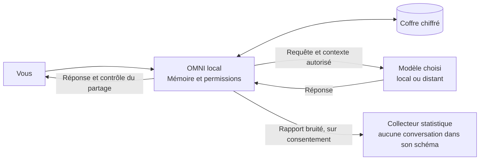

# 🧠 OMNI-OS · Compression of Comprehension.

### Vos IA changent. Votre mémoire reste.

**OMNI est une mémoire personnelle locale et une porte d’accès contrôlée vers vos IA.** Il conserve le contexte que vous choisissez, vous laisse le corriger et transmet uniquement les souvenirs que vous autorisez à un fournisseur donné.

> Les modèles apportent le calcul. Vous gardez l’histoire et les règles.

[Manifeste](MANIFESTO.md) · [Architecture](ARCHITECTURE.md) · [Schémas](DIAGRAMS.md) · [Roadmap](ROADMAP.md)


## Le problème tient en une phrase

Changer d’IA ne devrait pas obliger à reconstruire toute sa relation avec elle.

Les services peuvent déjà avoir leur propre mémoire. OMNI vise une continuité que vous gouvernez entre les outils : vos préférences, vos projets, vos corrections et vos limites. Le but est la **compression de la compréhension** : fournir le contexte utile, sans recopier votre vie entière. Le gain en temps, en tokens et en qualité doit être mesuré.

## Trois gestes

1. **Mémoriser.** Ajoutez un fait ou capturez explicitement un échange. L’extraction locale propose des souvenirs à relire.
2. **Autoriser.** Choisissez les souvenirs, le fournisseur et la durée d’accès. Une proposition non confirmée reste hors du contexte transmis.
3. **Continuer.** Interrogez le modèle depuis le launcher ou une intégration compatible. Consultez les reçus de partage et révoquez l’accès quand il n’est plus nécessaire.

La révocation bloque les nouveaux partages via OMNI. Elle ne rappelle pas les copies déjà reçues par un fournisseur.

## Essayez-le

Prérequis : **Node.js 22.13+**, npm et les outils de compilation de votre plateforme. Sur macOS : Command Line Tools. Le premier lancement télécharge les dépendances et installe Rust s’il manque.

```bash
git clone https://github.com/nabz0r/OMNI-OS.git
cd OMNI-OS
./run.sh --web --simulate
```

Ouvrez [localhost:3006](http://localhost:3006), puis déverrouillez la session avec le jeton contenu dans `.omni/runtime/admin-token`. Il reste privé sur votre appareil.

La démonstration crée **six clients, deux faux fournisseurs et un hub VPN de test**. Les réponses LLM sont fictives ; le chiffrement WireGuard, les coffres SQLCipher, les permissions et les calculs OpenDP s’exécutent réellement. Aucun compte IA ni clé fournisseur n’est nécessaire. Les résultats sont consultables dans **Connections** et **Collective**.

Sur macOS, `./run.sh --simulate` lance aussi la fenêtre native Tauri. Pour utiliser votre propre modèle, retirez `--simulate` : OMNI attend par défaut Ollama et le modèle installé `qwen3:0.6b`. Les autres fournisseurs se configurent explicitement. [Guide d’intégration →](docs/INTEGRATIONS.md)

## Où va l’information ?



Le fournisseur distant reçoit la requête nécessaire à son travail, protégée par HTTPS pendant le transport. Le collecteur statistique reçoit un rapport numérique distinct. **L’analytique est désactivée par défaut hors simulation.** La confidentialité différentielle borne une divulgation statistique ; elle ne promet pas l’anonymat absolu.

## Déjà dans le dépôt

| Fonction                 | Implémentation actuelle                                                                                   |
| ------------------------ | --------------------------------------------------------------------------------------------------------- |
| Mémoire locale           | SQLCipher, provenance, historique, correction et suppression                                              |
| Autorité                 | Permissions par destination et souvenirs, expiration, révocation, reçus                                   |
| Intégrations             | Launcher, API Chat Completions et Messages, outils MCP, capture navigateur explicite                      |
| Interface                | Nebula en Three.js, shell Tauri, mode basse consommation                                                  |
| Transport optionnel      | WireGuard/BoringTun, knocking authentifié, anti-rejeu, rotation des clés d’identité toutes les 30 minutes |
| Statistiques volontaires | OpenDP, budget persistant, reprises sans nouveau bruit ; collecteur Fastify et Redis                      |
| Vérification             | Simulation reproductible, tests Linux/macOS, construction du serveur et test BoringTun ↔ WireGuard Linux  |

**Version de développement fonctionnelle.** Le VPN ne déchiffre pas les applications HTTPS et le lancement de démonstration ne reconfigure pas votre réseau. Le Knowledge Graph sémantique, les identités distinctes par agent, le coffre isolé par l’OS, SingleStore, le déploiement Kubernetes et la fédération sont des étapes de la [roadmap](ROADMAP.md). Le déploiement public et la distribution macOS signée restent à réaliser.

## Lire, comprendre, construire

| Document                                                                                            | Ce qu’il apporte                                                              |
| --------------------------------------------------------------------------------------------------- | ----------------------------------------------------------------------------- |
| [MANIFESTO.md](MANIFESTO.md)                                                                        | L’origine, la conviction, les engagements                                     |
| [ARCHITECTURE.md](ARCHITECTURE.md)                                                                  | Les frontières de confiance, la mémoire et les contrats techniques            |
| [DIAGRAMS.md](DIAGRAMS.md)                                                                          | Les flux, le graphe de connaissances, les conteneurs et le VPN                |
| [ROADMAP.md](ROADMAP.md)                                                                            | De la preuve individuelle au million d’utilisateurs, avec critères de passage |
| [Exploitation](docs/OPERATIONS.md) · [VPN](docs/VPN.md)                                             | Lancement, enrôlement et déploiement                                          |
| [Confidentialité](docs/PRIVACY.md) · [Sécurité](docs/SECURITY.md)                                   | Garanties précises et limites                                                 |
| [Validation](docs/VALIDATION.md) · [CI](https://github.com/nabz0r/OMNI-OS/actions/workflows/ci.yml) | Résultats observés et vérifications de chaque révision                        |

Le code se répartit entre `crates/omni-core`, `crates/omni-vpn`, `apps/desktop`, `apps/extension` et `services/collector`. Les scripts de lancement sont à la racine ; l’infrastructure est dans `infra/`.

Pour reproduire les vérifications, arrêtez d’abord la démonstration, puis exécutez `./scripts/verify.sh`. Le test Redis nécessite une base de test dédiée ; les prérequis sont détaillés dans le compte rendu de validation.

**Le modèle économique proposé : être payé par les utilisateurs pour les représenter.** Continuité, intégrations et déploiements privés constituent les services envisagés. Vente de profils et publicité comportementale restent hors de cette doctrine ; aucune facturation n’est encore implémentée.

[AGPL-3.0](LICENSE). Les notes `ID network archi.md` et `protocoles.md` conservent l’historique de conception. Les documents ci-dessus distinguent le fonctionnement livré de l’architecture cible.
