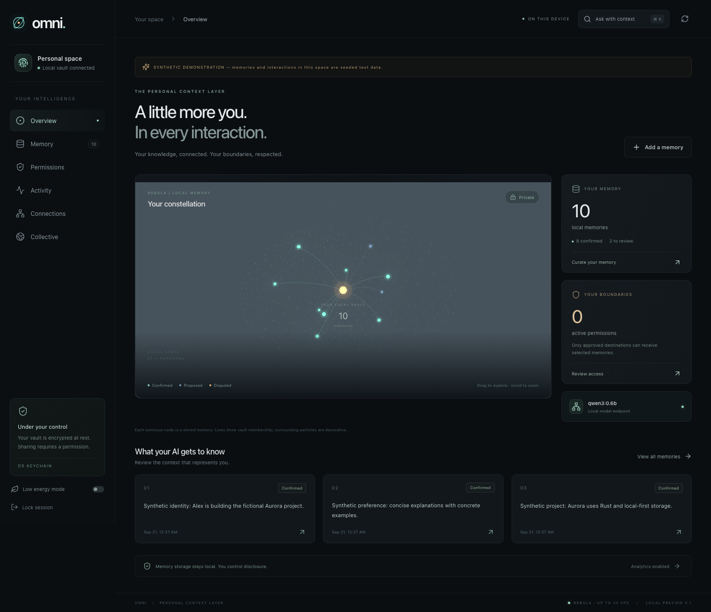
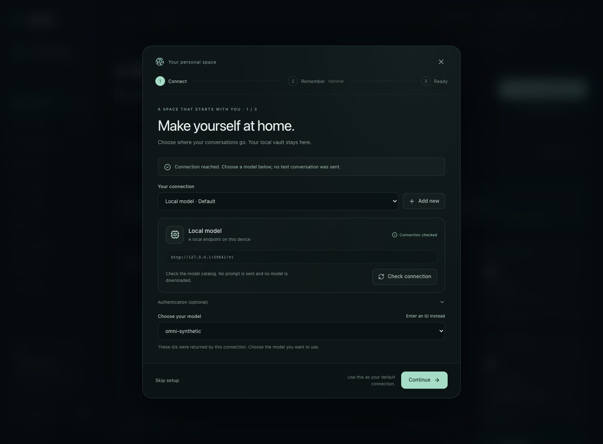
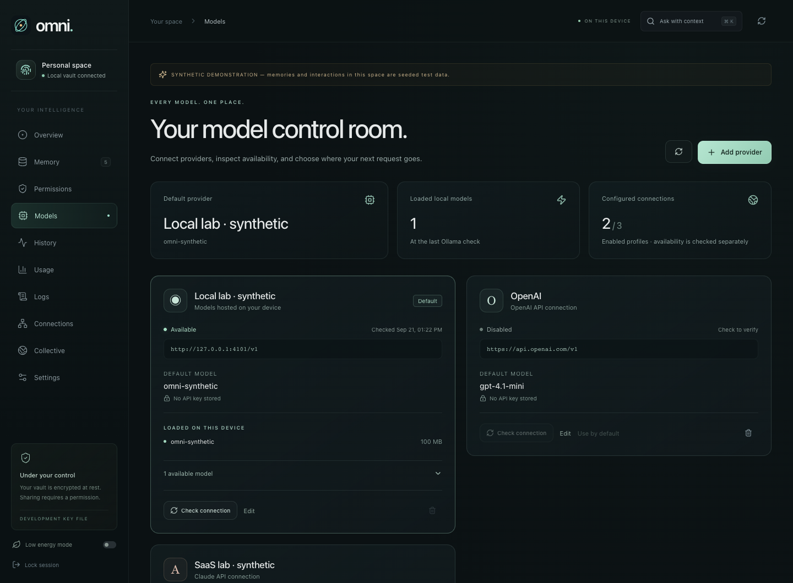
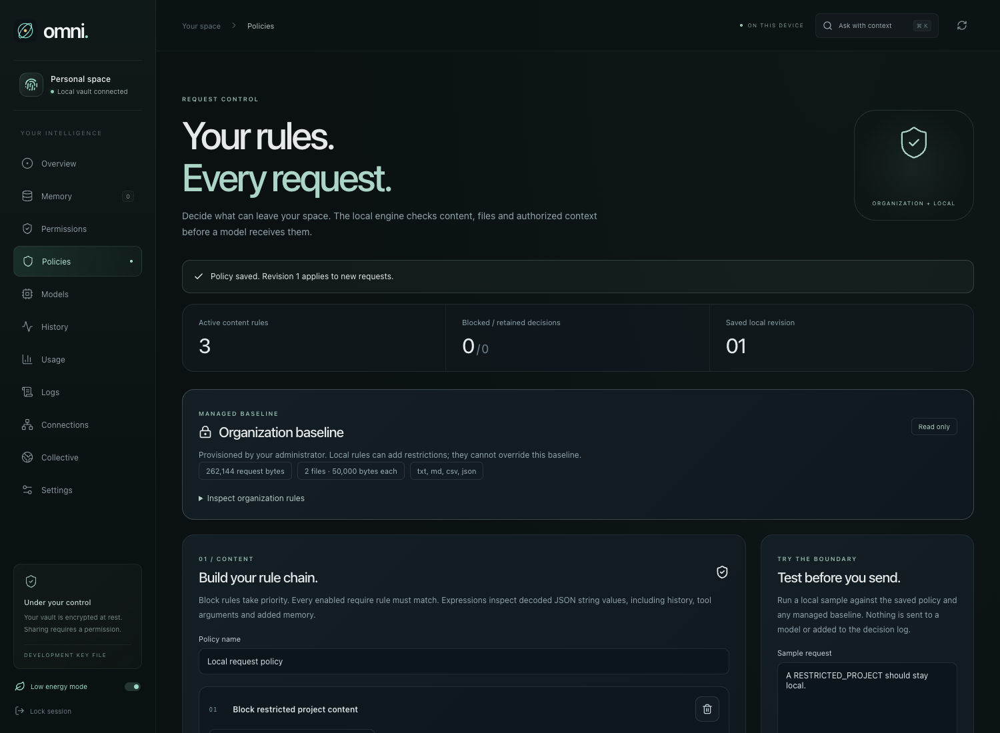
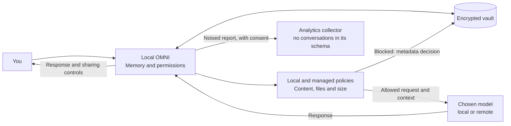

#  OMNI-OS · Compression of Comprehension.

### Your AI changes. Your memory stays.

**OMNI is a local personal memory and a controlled gateway to your AI tools.** It keeps the context you choose, lets you correct it, and shares only the memories you authorize for a specific provider. Its policy engine also checks request content, files and injected context before a model receives them.

> Models provide the computation. You keep the history and set the rules.

[Manifesto](MANIFESTO.md) · [Architecture](ARCHITECTURE.md) · [Diagrams](DIAGRAMS.md) · [Platforms](docs/PLATFORMS.md) · [Roadmap](ROADMAP.md)



## The problem in one sentence

Changing AI tools should not mean rebuilding your entire relationship with them.

Services may already have their own memory. OMNI aims to give you continuity that you control across tools: your preferences, projects, corrections, and boundaries. The goal is **compression of comprehension**: provide useful context without copying your entire life. Savings in time and tokens, and improvements in quality, must be measured.

## Three steps

1. **Remember.** Add a fact or explicitly capture a conversation. Local extraction proposes memories for you to review.
2. **Authorize.** Choose the memories, the provider, and how long access lasts. Unconfirmed proposals stay out of shared context.
3. **Continue.** Ask your model through the launcher or a compatible integration. The launcher carries recent exchanges forward, formats code and tables, and lets you copy replies. Review disclosure receipts and revoke access when it is no longer needed.

Use **Import text** to turn notes into reviewable proposals. Filter memories by status, correct them, and confirm what represents you. Changing authorized memories resets the launcher conversation; locking your space clears its history and drafts.

Revocation blocks future sharing through OMNI. It cannot retrieve copies a provider has already received.

## Native applications and the development demo

**Download [OMNI 0.2.0 for macOS and Android](https://github.com/nabz0r/OMNI-OS/releases/tag/v0.2.0).** This evaluation release includes **Policies**, text attachments, memory, model administration, history and usage. Open the DMG on an Apple Silicon Mac with macOS 14.4+, or install the APK on Android ARM64/x86_64 with API 24+ and a current System WebView. No development tools or OMNI server are required; connect your own model or provider account. The complete package and offline guide also live in `deliverables/OMNI-0.2.0-mvp/`. The exact APK passed 28 native acceptance checks, five Keystore tests and seven in-place upgrade checks from the previous evaluation APK. The Mac package passed native startup and package-integrity checks. These are ad-hoc/development-signed packages; Developer ID, notarization and Play Store distribution remain separate. [Installation and release details →](docs/DELIVERY.md)

The native application embeds the Rust core and SQLCipher vault in the application process. Its interface uses authenticated native messages; it starts no local HTTP listener or Node.js service. Native adapters cover macOS, Windows, Linux, Android and iOS, with a separate vault in each platform's application-data directory and keys protected by the platform credential store. [Platform architecture and build instructions →](docs/PLATFORMS.md)

These are implemented source targets, not a claim that every installer, device or store release has been validated. The [validation report](docs/VALIDATION.md) records actual build and device results. Apple device distribution and public releases still need the appropriate signing identities and release checks. No local inference model is bundled, and mobile apps do not install a system-wide VPN or background interception service.

The iOS build script distinguishes its default simulator target from `ios --device`, which produces an unsigned iPhone ARM64 archive when the build succeeds. That archive is not an installable signed release: Apple signing and provisioning remain required. [Build targets and artifact locations →](docs/PLATFORMS.md#build-from-source)

To try the reproducible **source development demo**:

Requirements: **Node.js 22.13+**, npm, and your platform's build tools. On macOS, install Command Line Tools. The first launch downloads dependencies and installs Rust if it is missing.

```bash
git clone https://github.com/nabz0r/OMNI-OS.git
cd OMNI-OS
./run.sh --web --simulate
```

The local interface opens automatically with a private, single-use connection link. No token copy is needed in this normal launch. For headless operation, add `--no-open`; manual unlock uses the private token in `.omni/runtime/admin-token`. [First-run guide →](docs/GETTING_STARTED.md)

The demo uses a separate synthetic vault with a development file key, leaving existing personal and Keychain-backed vaults untouched. It creates **six clients, two simulated providers, and a test VPN hub**. LLM responses are fictional; WireGuard encryption, SQLCipher vaults, permissions, and OpenDP calculations run as actual code. No AI account or provider key is required. Results appear in **Connections** and **Collective**. The viewer also sends synthetic exchanges through both configured providers, populating **History** and **Usage** with measured request metadata.

On macOS, `./run.sh --simulate` opens the native Tauri window against the same external development services. The script explicitly sets `OMNI_EXTERNAL_CORE=1`; this is separate from a standalone native launch and its application-data vault. To use your own models in the development stack, omit `--simulate`. Run `./run.sh --doctor` for a read-only startup check. [First-run guide →](docs/GETTING_STARTED.md)

For either mode, follow **Guided setup**: connect a provider, optionally save a first memory, and open a conversation. Desktop defaults point to local Ollama; mobile starts with an unconfigured cloud profile that requires your own credential and model choice. The native app ships without an analytics collector, so analytics cannot be enabled until a deployment supplies one. Locking hides the interface and clears its transient conversation; **Unlock on this device** deliberately reopens the native session. This is an interface lock, not biometric authentication or an operating-system security boundary.

## A first run that leads somewhere

**Connect → Remember → Continue.** A guided setup opens for a fresh vault. Connect a model without searching through settings, keep an optional preference locally, and start your first conversation. Setup grants no memory access and sends no inference request on your behalf. The home screen then gives you a direct **Start a conversation** action, with draft-only suggestions inside the launcher.



## One place to run your AI connections

Open **Models** to connect Ollama, OpenAI, Anthropic, or a compatible endpoint. Store a key in the encrypted vault, check the connection, choose an available model, and make it your default. The launcher can switch provider and model for a new conversation.

| Your question                                          | Where to look                                                                                                      |
| ------------------------------------------------------ | ------------------------------------------------------------------------------------------------------------------ |
| Which models can I use? Which ones are loaded locally? | **Models** — provider catalogs and Ollama's loaded models, checked on demand                                       |
| Which model handled a request, and what happened?      | **History** — destination, operation, status, timing, tokens and payload bytes; separate disclosure receipts       |
| What am I consuming?                                   | **Usage** — reported input/output/cache tokens, observation coverage, per-model totals and optional cost estimates |
| What changed in my installation?                       | **Logs** — structured local audit events without conversation content or secrets                                   |
| How is my space configured?                            | **Settings** — history retention, local extraction, analytics consent, display preferences and deployment details  |

**Savings must be earned, not invented.** Usage compares selected source size with inserted context as a clearly labeled benchmark. It does not claim to measure internet bandwidth saved or a better answer. Missing provider counters stay unknown. Cost estimates require your own rates and sufficient usage data; they are not invoices. ChatGPT and Claude website sessions are not automatically monitored. [Console guide →](docs/ADMINISTRATION.md)



## Memory remembers. Policies decide.

Open **Policies** to set permitted text-file types, file counts and size limits, then build a chain of regex rules that block matching content or require a marker. Try a sample locally before sending. The decision trail explains allowed and blocked checks without retaining prompts, file names or matched text.

An organization can provision a mandatory baseline at startup. The local editor can add restrictions but cannot override it. The same Rust checks cover the launcher, both compatible gateways, capture and MCP memory disclosure. History, tool arguments and authorized context are included; a memory grant never bypasses a policy.



This release handles inspectable UTF-8 text files. It rejects recognized opaque and binary attachment forms, and does not filter responses or enforce device-wide routing. Enterprise fleet management and signed policy distribution remain roadmap work. [Policy editor, deployment, API and exact limits →](docs/POLICIES.md)

## Where does the information go?



The remote provider receives the request it needs to do its work, protected by HTTPS in transit. A configured analytics collector receives a separate numeric report. **Analytics is disabled by default outside simulation and unavailable in the default standalone native configuration.** Differential privacy bounds statistical disclosure; it does not promise absolute anonymity.

## Already in the repository

| Capability          | Current implementation                                                                                                |
| ------------------- | --------------------------------------------------------------------------------------------------------------------- |
| Local memory        | SQLCipher, provenance, history, correction, and deletion                                                              |
| Request policies    | Regex block/require rules, inspectable text files, size limits, managed baseline and private decision trail           |
| Authority           | Permissions scoped to destinations and memories, expiration, revocation, and receipts                                 |
| Integrations        | Launcher, Chat Completions and Messages APIs, MCP tools, and explicit browser capture                                 |
| Interface           | Shared Three.js/React UI, native embedded core, platform key-store adapters, model administration and low-energy mode |
| Optional transport  | WireGuard/BoringTun, authenticated knocking, replay protection, and identity-key rotation every 30 minutes            |
| Local observability | Encrypted request metadata, bounded retention, structured audit, model discovery and manual-rate estimates            |
| Voluntary analytics | OpenDP, persistent budget, retries without new noise; Fastify and Redis collector                                     |
| Verification        | Reproducible simulation, Linux/macOS tests, server build, and BoringTun ↔ Linux WireGuard interoperability test       |

**A development release with explicit platform boundaries.** The VPN does not decrypt HTTPS applications, and the demo does not reconfigure your network. A semantic knowledge graph, distinct agent identities, an OS-isolated vault, personal device synchronization, SingleStore, Kubernetes deployment, and federation are [roadmap](ROADMAP.md) milestones. Public deployment, signed distribution and store acceptance remain separate release work.

## Read, understand, build

| Document                                                                                            | What it covers                                                            |
| --------------------------------------------------------------------------------------------------- | ------------------------------------------------------------------------- |
| [MANIFESTO.md](MANIFESTO.md)                                                                        | The origin, conviction, and commitments                                   |
| [ARCHITECTURE.md](ARCHITECTURE.md)                                                                  | Trust boundaries, memory, and technical contracts                         |
| [DIAGRAMS.md](DIAGRAMS.md)                                                                          | Request flows, knowledge graph, containers, and VPN                       |
| [ROADMAP.md](ROADMAP.md)                                                                            | From individual value to a million users, with measurable gates           |
| [Getting started](docs/GETTING_STARTED.md)                                                          | First launch, guided setup and recovery                                   |
| [Platforms](docs/PLATFORMS.md)                                                                      | Embedded runtime, native key stores, build targets and limits             |
| [Policies](docs/POLICIES.md)                                                                        | Content and file rules, managed baseline, integration contract and limits |
| [Administration](docs/ADMINISTRATION.md)                                                            | Models, settings, history, logs and measurement definitions               |
| [Operations](docs/OPERATIONS.md) · [VPN](docs/VPN.md)                                               | Startup, enrollment, and deployment                                       |
| [Privacy](docs/PRIVACY.md) · [Security](docs/SECURITY.md)                                           | Precise guarantees and limitations                                        |
| [Validation](docs/VALIDATION.md) · [CI](https://github.com/nabz0r/OMNI-OS/actions/workflows/ci.yml) | Observed results and revision checks                                      |

Code lives in `crates/omni-core`, `crates/omni-vpn`, `crates/tauri-plugin-omni-device`, `apps/desktop`, `apps/extension`, and `services/collector`. `apps/desktop` contains the shared desktop/mobile interface and Tauri application despite its historical directory name. Startup scripts are at the repository root; infrastructure lives in `infra/`.

To reproduce the checks, stop the demo first, then run `./scripts/verify.sh`. The Redis test requires a dedicated test database; prerequisites are detailed in the validation report.

The six browser QA suites include `npm run test:native`: a mocked Tauri invocation bridge backed by a real isolated core and encrypted vault. It checks the native frontend contract, not OS key custody or phone execution. The [interface guide](apps/desktop/README.md#browser-verification) describes how to run these suites; platform and device evidence remains separate. `npm run test:policies` adds real-core policy editing, preview, blocked egress, text-file sending and follow-up enforcement checks.

**The proposed business model: users pay OMNI to represent their interests.** Continuity, maintained integrations, and private deployments are the services being considered. Selling profiles and behavioral advertising are outside this doctrine; billing is not implemented yet.

All repository documentation, interface copy, examples, and code comments are written in English for an international audience. The [repository guidance](AGENTS.md) preserves this policy for future contributions.

[AGPL-3.0](LICENSE). [Network design notes](NETWORK_DESIGN_NOTES.md) and [protocol notes](PROTOCOL_NOTES.md) preserve the design history. The documents above distinguish implemented behavior from target architecture.
