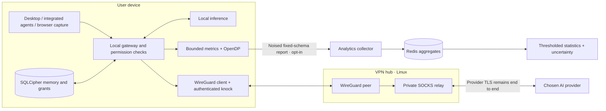

# OMNI · Your memory. Your authority.

Local-first memory, explicit permissions, a cognitive gateway, and a real WireGuard transport. OMNI helps you decide what an AI may know and what an agent may do. It does not claim to intercept every application, erase data already disclosed, or infer your psychological state.

**The repository includes an executable synthetic lab.** Its fictitious clients, memories, and providers are labeled. WireGuard cryptography, authenticated knocking, key-rotation checks, encrypted vaults, permission checks, differential privacy, and the collector run as actual code.


## Start

Requirements: macOS with Command Line Tools, or Linux for the headless services; Node.js 22.13+; internet for the first dependency install. The bootstrap installs Rust if needed. The desktop uses the platform Tauri prerequisites.

```bash
git clone https://github.com/nabz0r/OMNI-OS.git
cd OMNI-OS
./run.sh --web --simulate
```

Open **http://localhost:3006**. Unlock the console with the value in `.omni/runtime/admin-token`. This credential stays on your machine. The simulation starts six independent SQLCipher-backed clients, two fictitious LLM providers, a collector, and a WireGuard hub exercise. Results appear in the **Network / Simulation** experience and `.omni/simulation-latest.json`.

For the native Tauri application, omit `--web`. For your own local LLM, omit `--simulate`; the default provider is Ollama on loopback with `qwen3:0.6b`. Configure `OMNI_LLM_BASE` and `OMNI_LLM_MODEL` for another provider. Missing models or credentials produce explicit errors, never fabricated answers. All synthetic providers bind to loopback and make no external AI calls.

```bash
# Repeat the isolated lab without opening a UI:
./scripts/bootstrap.sh
npm run simulate

# Production/development WireGuard configuration and enrollment:
./start_network.sh --help

# Checks:
CARGO_TARGET_DIR="$(node scripts/build-dir.mjs)" cargo test --workspace --locked
npm test
npm run build
```

## What crosses each boundary



The production VPN hub transports TLS bytes. It is not an LLM termination point. The synthetic VPN test intentionally decrypts synthetic tasks at its test hub to drive loopback provider fixtures; this exercises the protocol and is **not** the production trust boundary. See [architecture](docs/ARCHITECTURE.md), [VPN deployment](docs/VPN.md), and [security](docs/SECURITY.md).

The gateway currently supports the OpenAI Chat Completions and Anthropic Messages protocols. See [integration examples](docs/INTEGRATIONS.md) for explicit agent connections and permission headers. Configuration is supplied as environment variables; `.env.example` documents them but is not loaded automatically.

## Capabilities and boundaries

- **Memory:** create, review, correct, search and delete sourced memories in an encrypted database.
- **Authority:** separate console and agent credentials; destination-scoped, expiring and revocable grants; local disclosure receipts.
- **Gateway:** explicit provider integration, streaming and cancellation; no global TLS interception certificate.
- **VPN:** BoringTun cryptography, authenticated single-packet knocking, replay protection, and a 30-minute client identity-key rotation policy. WireGuard uses Noise, **not IKE**.
- **Analytics:** three eight-bin histograms, local privacy budget, immutable retries and atomic deduplication; analytics disabled unless opted in.
- **Nebula:** interactive memory constellation, permission controls and labeled network/global views; idle and reduced-motion behavior.
- **Browser extension:** explicit capture of visible content in supported sites. It cannot read server-only prompts or hidden model state.

This is a development release. OS code signing, trusted redistribution and a real deployed VPN endpoint require deployment credentials and infrastructure. Application-level tests are not proof of resistance to a compromised operating system. The security document states the implemented guarantees and limitations.

## Repository

```text
apps/desktop/       React + Three.js UI and Tauri shell
apps/extension/     Explicit browser capture integration
crates/omni-core/   SQLCipher vault, permissions, provider gateway, MCP, OpenDP
crates/omni-vpn/    WireGuard, authenticated knock, rotation and synthetic lab
services/collector/ Fastify collector; Redis production / SQLite development
infra/             Server deployment and VPN operations
scripts/           Bootstrap, synthetic providers and end-to-end simulation
docs/              Architecture, privacy protocol, product and operations
DECISIONS.md       Five architectural decisions
```

AGPL-3.0. The pre-existing `ID network archi.md` is preserved as historical design material. Current operational contracts live in the code and documents linked above.
