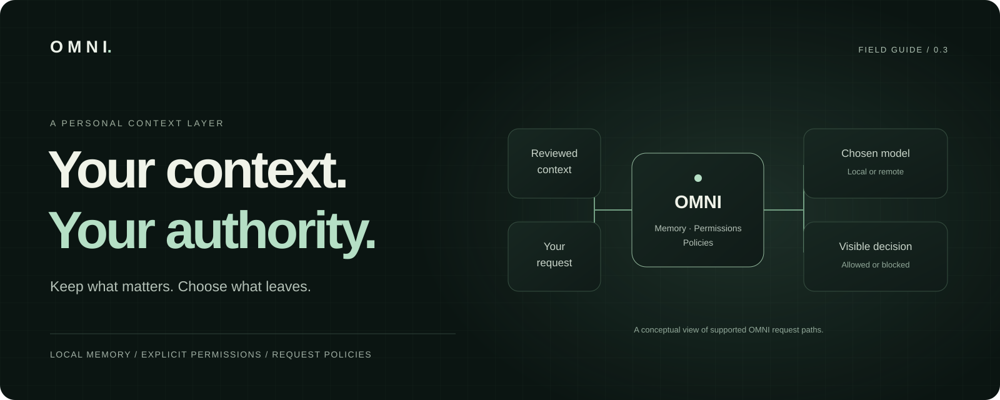
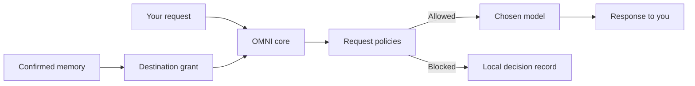

<p align="center">
  <a href="docs/README.md"><strong>Explore the documentation</strong></a> ·
  <a href="docs/GETTING_STARTED.md">Get started</a> ·
  <a href="docs/DELIVERY.md">Install the apps</a> ·
  <a href="docs/PRO_MVP.md">OMNI for work</a>
</p>

# Your AI changes. Your memory stays.

OMNI keeps the context you choose in a local encrypted vault and controls how it reaches your AI tools. Review memories, grant access to a specific destination, and check requests against your rules before a model receives them.

**Keep what matters. Choose what leaves. See what happened.**

A remote model still receives the request and context you send to it. OMNI's control applies to its supported request paths. The optional VPN protects transport; it does not unlock encrypted conversations inside other apps.

## Begin where you are

| I want to… | Start here |
| --- | --- |
| Use the Mac or Android application | [Install and connect a model](docs/GETTING_STARTED.md) |
| Bring context from ChatGPT or Claude | [Review and import a conversation](docs/CONVERSATION_IMPORT.md) |
| Control what a model receives | [Permissions and integrations](docs/INTEGRATIONS.md) · [Request policies](docs/POLICIES.md) |
| Evaluate OMNI for a team | [Professional MVP scope](docs/PRO_MVP.md) · [Pilot proposal](docs/funding/PILOT_PROPOSAL.md) |
| Inspect the implementation | [Architecture map](docs/ARCHITECTURE.md) · [Security boundary](docs/SECURITY.md) |
| Check the evidence | [Release validation](docs/VALIDATION.md) · [Roadmap](ROADMAP.md) |

## One workspace, three deliberate steps

**01 · Remember.** Add a preference or import selected conversation messages. Extraction creates proposals. You decide which facts represent you.

**02 · Authorize.** Select confirmed memories, an exact destination and an expiry. A policy check still applies; a sharing grant never overrides it.

**03 · Continue.** Use the launcher or a compatible integration. Inspect the destination, request outcome and disclosure receipt. Revoke access to stop future sharing through OMNI.

Revocation cannot retrieve content a provider has already received. The launcher stays transient. Work adds explicitly opted-in, scoped conversations with retention, separate human/model roles and deletion. [Use Work →](docs/WORK.md)


*Actual application interface. Demonstration content is synthetic, not customer activity.*

## The 0.4.0 work increment

**Named authority, deliberate continuity and recoverable context.** Work adds a dedicated single-owner installation, separately approved API clients, an optional local gateway, scoped conversation storage and encrypted recovery. The complete controlled-context loop runs through two independent reference clients and a counted synthetic provider.

| Proof | Measured scope |
| --- | --- |
| **80 core tests** | Isolation, grants, policy, recovery, continuity, streaming and existing privacy contracts |
| **16 controlled-loop checks** | Actual core process, JavaScript and Python HTTP clients, verified receipts and zero denied upstream arrivals |
| **40 latency observations** | Local policy/preflight measured separately from a synthetic response delay; no SLA |
| **Shared Work interface** | Enrollment, explicit consent, role preservation, deletion and a 390-pixel browser layout |

[Work guide →](docs/WORK.md) · [Recovery →](docs/RECOVERY.md) · [Supported matrix and evidence →](docs/WORK_VERIFICATION.md)

The macOS and Android applications embed the interface, Rust core and SQLCipher vault. No Node.js, Rust, Docker or separate OMNI server is needed to run an installed app. Supply your own model endpoint or provider account. Apple Silicon/macOS 14.4+ and Android ARM64/x86_64/API 24+ are build targets; runtime evidence is narrower and attached to each exact package.

[Installers and exact release scope](docs/DELIVERY.md) · [0.4.0 release notes](docs/releases/v0.4.0.md). Generated local packages live under `deliverables/`; that ignored folder is not included in a fresh clone. Application source, documentation, build recipes and versioned evidence contracts are on `main`. The preserved [public 0.2.0 release](https://github.com/nabz0r/OMNI-OS/releases/tag/v0.2.0) predates these changes. Ad-hoc macOS and development Android signatures are evaluation identities, not production signing.

## Control the request, understand the boundary



| Surface | Delivered behavior | Limit |
| --- | --- | --- |
| Memory | Local SQLCipher storage, proposed/confirmed states, correction and provenance | Bounded encrypted recovery; no continuous backup or synchronization |
| Conversation import | Supported ChatGPT, Claude and neutral JSON files; explicit message review | No account login, automatic history sync or deduplication |
| Request policies | Regex block/require rules, inspectable text files, size limits and managed baseline | No universal DLP, response filtering or device-wide enforcement |
| Connections | Launcher, explicit Chat Completions/Messages gateway and MCP memory tools | Native apps open no listener by default; Work can expose a named-client-only gateway |
| Browser capture | User-triggered visible or selected text; Z.AI supports selection only | Separate extension; no automatic pairing with the standalone app |
| Observability | Local request metadata, token counters, receipts and audit events | Missing counters stay unknown; manual cost estimates are not invoices |
| Work continuity | Opt-in project conversations, original roles, bounded history and deletion | One owner; no semantic retrieval or cross-device sync |
| Optional analytics | OpenDP with a persisted privacy budget | Disabled by default outside simulation; no collector in the standalone app |

[Integration contracts](docs/INTEGRATIONS.md) · [Privacy protocol](docs/PRIVACY.md) · [Optional VPN](docs/VPN.md)

<details>
<summary><strong>A closer look at the workspace</strong></summary>

### Connect your models

Manage provider profiles, discover available models and choose where a new conversation goes. A ChatGPT or Claude web subscription is not an API credential.


### Set rules before sending

Preview saved policies locally. Inspect allow/block decisions without retaining matching prompt text in the decision journal.


</details>

## Try the source demo

Requires **Node.js 22.13+**, npm and platform build tools. On macOS, install Command Line Tools. First launch downloads project dependencies and installs Rust if it is missing.

```bash
git clone https://github.com/nabz0r/OMNI-OS.git
cd OMNI-OS
./run.sh --web --simulate
```

The launcher opens a private, single-use local connection link. The simulation uses a separate synthetic vault, six clients and two fictional model providers. SQLCipher, permissions, WireGuard and differential-privacy computations execute real code. It does not reconfigure your network or convert a personal vault into demo data.

Use `./run.sh --doctor` for a read-only startup check. Omit `--simulate` to use your own model services. A native development window uses the launcher's external services; the installed standalone app has its own embedded core and vault. [Full setup and recovery guide →](docs/GETTING_STARTED.md)

## Built around explicit contracts

| Location | Responsibility |
| --- | --- |
| `crates/omni-core` | Vault, grants, policies, provider gateway and analytics accounting |
| `apps/desktop` | Shared React interface and Tauri desktop/mobile shell |
| `crates/tauri-plugin-omni-device` | Platform key custody and metadata export |
| `apps/extension` | Explicit browser capture |
| `crates/omni-vpn` · `infra/` | Optional encrypted transport and deployment tools |
| `services/collector` | Numeric-report collection |

After the documented prerequisites, use `./scripts/verify.sh` for application checks. Use `npm run docs:build` to create the offline documentation portal and `npm run docs:check` to validate documentation links and diagrams. [Contributor guide →](docs/DOCUMENTATION.md)

## The next proof is useful work

The professional direction is approved reusable context plus inspectable request control in a workflow people already use. Shared team identity, production distribution, physical-device recovery drills, independent review and measured customer value remain work to complete. Billing and validated commercial traction are not established by this repository.

[Professional MVP](docs/PRO_MVP.md) · [Roadmap](ROADMAP.md) · [Venture assessment](docs/assessment/README.md) · [2027 application package](docs/funding/README.md)

---

[The field guide](docs/README.md) · [Product principles](MANIFESTO.md) · [Security](docs/SECURITY.md) · [AGPL-3.0](LICENSE)

Documentation, interface copy and examples are in English. [Repository guidance](AGENTS.md) preserves that convention. Historical proposals remain explicitly labelled in the [design notes](NETWORK_DESIGN_NOTES.md) and [protocol notes](PROTOCOL_NOTES.md).
