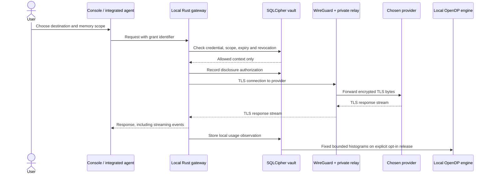
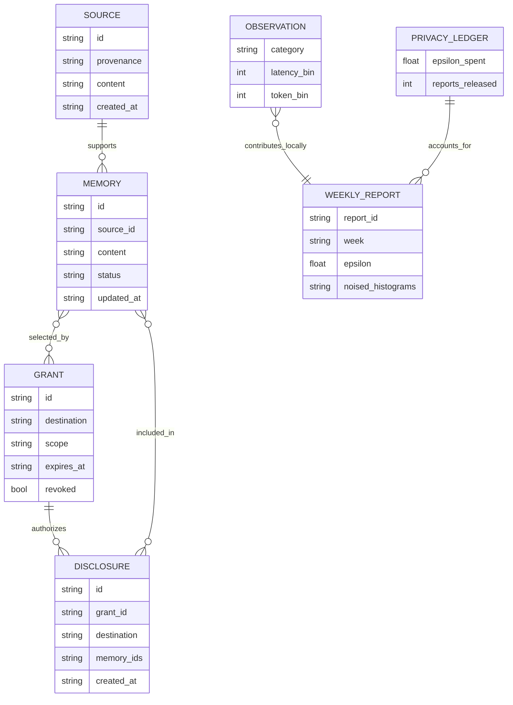
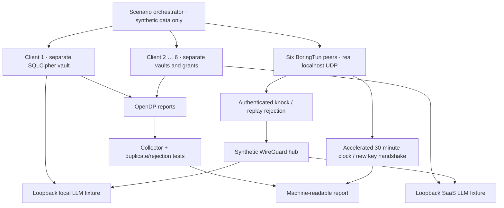

<!-- omni:header -->
[OMNI](../README.md) / [Field guide](README.md) / Build & operate

> **Implementation map** · Implementation paths, native IPC, persisted objects and trust boundaries.
<!-- /omni:header -->

# Architecture and transaction paths

This is the concise implementation map. Read the [architecture book](../ARCHITECTURE.md) for the doctrine, trust boundaries and target design, and the [diagram collection](../DIAGRAMS.md) for the current and planned flows.

## Authorized AI transaction

Local inference uses a loopback provider and does not require the tunnel. When VPN routing is configured, the gateway must use the configured SOCKS transport without direct fallback. A failed tunnel is an error, not authorization to bypass it.

The diagram shows the explicitly configured VPN path. A standalone native app does not install that path or a mobile VPN extension. Native UI requests enter the same core through authenticated IPC and return a bounded complete body; the optional external gateway preserves supported provider streams.

## Native application boundary

Tauri links `omni-core` directly and starts it with explicit `EmbeddedOptions`. The native device adapter retrieves or creates a random 32-byte key in the platform secure store, then passes it directly to Rust; frontend plugin invocations cannot read that key. SQLCipher opens a separate `vault-v1` directory under the OS application-local-data location. An exclusive lease prevents simultaneous embedded runtimes from opening that vault.

The main-window `native_session` command provisions an owner session. `core_request` checks the window and owner token, bounds concurrent calls, and dispatches local paths into the shared Axum router. The router retains owner/agent checks, exact destination grants and deployment policy. This mode opens no HTTP listener by default. Work can explicitly start a separate, ephemeral loopback listener with only the two named-client provider routes. Its own stop gate rejects new work on surviving keep-alive connections. The native bootstrap leaves it disabled. Work identity, conversation storage and recovery are described in [Work](WORK.md) and [Recovery](RECOVERY.md).

The app's interface lock clears transient UI state and requires an explicit device-unlock action to reopen it. It is not biometric authentication, OS confinement or key destruction. Mobile execution follows the platform application lifecycle; no background service, global capture or mobile VPN is implemented. The platform/key-store map and build procedures are in [PLATFORMS.md](PLATFORMS.md); measured results remain in [VALIDATION.md](VALIDATION.md).

## First-run session boundary

The source-development launcher creates a temporary random pairing secret for automatic browser opening. Its fragment is consumed before rendering; `/api/session/claim` returns the owner token exactly once within 120 seconds, with allowed-Origin checks and non-cacheable responses. The core retains a hash and atomic consumed state in memory. `run.sh` explicitly sets `OMNI_EXTERNAL_CORE=1` for a native window connected to those same external services. Standalone native startup instead provisions its embedded session, with browser pairing disabled. The setup UI calls existing owner-only profile and memory APIs; it does not bypass grants or infer new agent authority.

## Data model

The diagram is the logical model; JSON arrays may represent scope and memory references in SQLite. The private database stores detailed observations. The central store receives only noised report values and persists **aggregated sums/counts plus deduplication hashes**, not an individual searchable conversation store.

## Local administration and observability

The console reads owner-only administration endpoints in the same Rust core. Encrypted settings hold provider profiles, write-only credentials, manual rates, the primary destination, the local extractor and history preferences. Explicit native options or the external core's environment seed new vaults; deployment network policy remains an upper bound on profile routing.

Two additional SQLCipher tables, `journal_interactions` and `journal_audit`, hold operational metadata independently of DP observations. A request starts before provider egress and ends with a terminal status, body-byte counters and any supported usage fields. A drop guard marks interrupted requests; restart recovery marks unfinished records aborted. The journal does not store conversation content. Aggregates are derived from retained journal rows, preserving unknown usage, observation coverage and request-time rate snapshots.

The logical diagrams above focus on memory authorization and analytics. The complete administration API, actual storage names, retention behavior and metric definitions are documented in [ADMINISTRATION.md](ADMINISTRATION.md). The operational journal never feeds its detailed rows into the collector.

## Synthetic end-to-end laboratory

Two paths are deliberately tested separately: the application path checks memory, grants, provider protocol and analytics; the cryptographic path sends synthetic tasks through encrypted WireGuard packets to loopback provider fixtures. The simulator never claims that a host-wide VPN or a public SaaS deployment was installed. Its accelerated clock avoids waiting thirty real minutes and records the rotation assertions.

## Process and trust boundaries

A configured collector is a separate process and deployment from the core. The local model runtime is a separate service and is not bundled in the native app. Standalone native bootstrap supplies no collector: analytics activation, preparation and sending fail before report creation or budget use. Database and authorization operations are modules of the local core; in native mode the core is also part of the Tauri application process. This is **not an OS-isolated vault worker**. Local code compromise can access the unlocked vault. Signed helper confinement requires additional deployment work and must not be inferred from module names.

## Ports

These are source-development and explicit integration defaults. The standalone native UI uses IPC and starts none of these listeners; an explicitly enabled embedded listener chooses an ephemeral loopback port instead.

| Service                   | Default binding          | Purpose                                |
| ------------------------- | ------------------------ | -------------------------------------- |
| Nebula                    | 127.0.0.1:3006           | Local UI                               |
| Core                      | 127.0.0.1:3007           | Authenticated memory and gateway       |
| Collector                 | 127.0.0.1:3008           | Noised telemetry and public aggregates |
| Synthetic providers       | 127.0.0.1:4101–4102      | Test-only local/SaaS fixtures          |
| Synthetic clients         | 127.0.0.1:4201–4216      | Isolated test processes                |
| WireGuard / knock / relay | Deployment configuration | See VPN guide                          |

<!-- omni:footer -->
---

**Continue reading** · [Connect a client](INTEGRATIONS.md) · [Native platforms](PLATFORMS.md) · [Operate an installation](OPERATIONS.md)

[All documentation](README.md) · [Delivery and verification](DELIVERY.md)
<!-- /omni:footer -->
