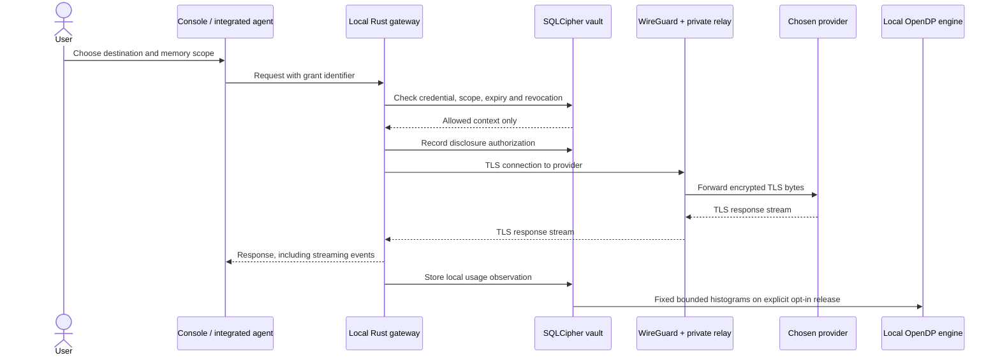
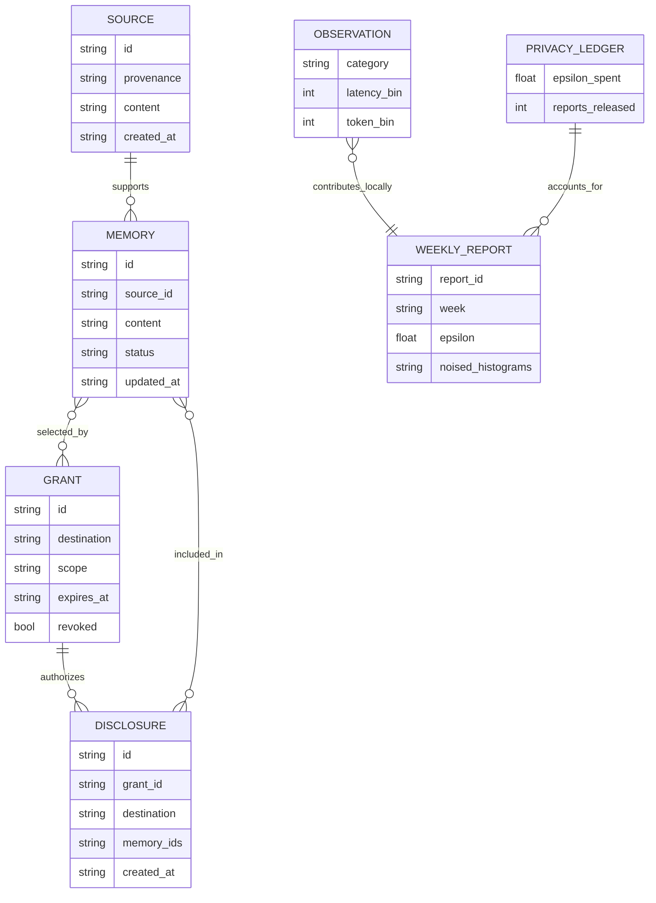
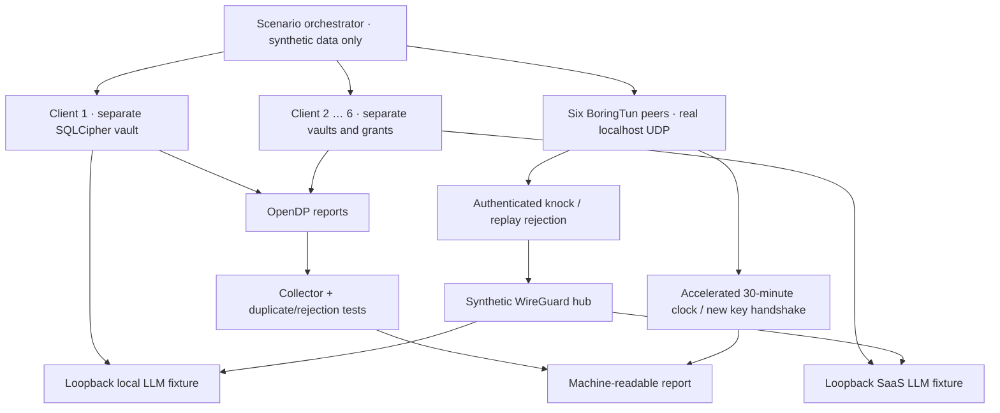

# Architecture and transaction paths

This is the concise implementation map. Read the [architecture book](../ARCHITECTURE.md) for the doctrine, trust boundaries and target design, and the [diagram collection](../DIAGRAMS.md) for the current and planned flows.

## Authorized AI transaction

Local inference uses a loopback provider and does not require the tunnel. When VPN routing is configured, the gateway must use the configured SOCKS transport without direct fallback. A failed tunnel is an error, not authorization to bypass it.

## Data model

The diagram is the logical model; JSON arrays may represent scope and memory references in SQLite. The private database stores detailed observations. The central store receives only noised report values and persists **aggregated sums/counts plus deduplication hashes**, not an individual searchable conversation store.

## Synthetic end-to-end laboratory

Two paths are deliberately tested separately: the application path checks memory, grants, provider protocol and analytics; the cryptographic path sends synthetic tasks through encrypted WireGuard packets to loopback provider fixtures. The simulator never claims that a host-wide VPN or a public SaaS deployment was installed. Its accelerated clock avoids waiting thirty real minutes and records the rotation assertions.

## Process and trust boundaries

The collector is a separate process and deployment from the core. The local model runtime is a separate service. Database and authorization operations are modules of the local core in this development release; this is **not yet an OS-isolated vault worker**. Local code compromise can access the unlocked vault. Native signed helper confinement requires additional deployment work and must not be inferred from module names.

## Ports

| Service | Default binding | Purpose |
|---|---|---|
| Nebula | 127.0.0.1:3006 | Local UI |
| Core | 127.0.0.1:3007 | Authenticated memory and gateway |
| Collector | 127.0.0.1:3008 | Noised telemetry and public aggregates |
| Synthetic providers | 127.0.0.1:4101–4102 | Test-only local/SaaS fixtures |
| Synthetic clients | 127.0.0.1:4201–4216 | Isolated test processes |
| WireGuard / knock / relay | Deployment configuration | See VPN guide |
