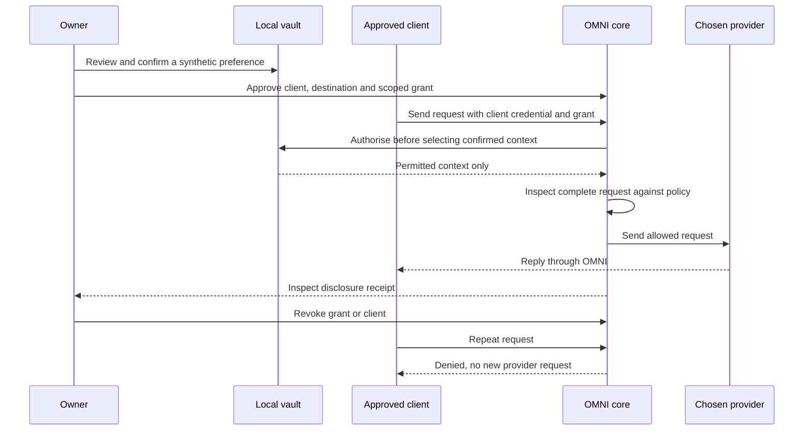

<!-- omni:header -->
[OMNI](../README.md) / [Field guide](README.md) / Use OMNI

> **Guide + API contract** · Named clients, scoped continuity and a dedicated single-owner installation.
<!-- /omni:header -->

# Work with explicit authority

OMNI 0.4.0 chooses **one owner per device installation or dedicated OS user account**. There is no shared organisation service. The Work screen is available in the common macOS and Android interface.

## Choose the installation before adding data

Use a dedicated work device or OS user with its own app data and key store. Work mode labels and enrolls the existing vault; it does not move personal records, create a second partition or add employer access. Enrollment disables the legacy integration token and cannot be switched off in the UI. The local owner can still administer the vault. OS administrators and a compromised owner process are outside this application's isolation guarantee.

Every installation has a random identifier. Independent installations have independent keys, memory, grants, client credentials, retrieval and audit records. A client credential issued by one installation is rejected by another. Recovery preserves the destination installation identifier and never revives old client access.

## Demonstrate the controlled-context loop

1. In **Memory → Import text → Import chats**, import a synthetic preference in a supported export. Review the selected human statement, then choose **Extract for review**. Extraction is local. The new memory is proposed, and no grant is created.
2. Review and confirm the memory. A model suggestion is not automatically promoted to a human fact.
3. In **Work**, enroll the dedicated installation. Approve a named client for exactly one configured destination and an expiry. Save the credential when it is shown; the vault retains a hash, not the reusable token.
4. Under **Grant selected memory to a client**, choose that client and only the confirmed facts it needs. The UI grants one hour; the effective access also requires the client itself to remain active.
5. In a native app, explicitly **Start local gateway** and use its displayed address. It binds an ephemeral port on `127.0.0.1`. Configure the approved client with its bearer credential and `X-Omni-Grant`. Optional `X-Omni-Provider` selects a configured profile. The destination must match both client approval and grant.
6. Send through OMNI. Inspect `X-Omni-Receipt` and the record in **History → Disclosure receipts**: exact destination, selected memory IDs and delivery status. A receipt records an authorised attempt; `sent` is not proof of a model's internal reasoning or deletion policy.
7. Revoke the grant and repeat. Then revoke the client and repeat without a grant. The counted-provider reference test proves those denied requests never arrive at its synthetic provider.

Run the [two reference clients](WORK_VERIFICATION.md) before adding another protocol or making a third-party compatibility claim.

## A controlled request, end to end

## Native gateway boundary

The default native route remains authenticated in-process IPC. The optional listener exposes only `/v1/chat/completions` and `/v1/messages`, with named-client authentication. It rejects owner and legacy integration credentials. It has no owner administration, capture, recovery or MCP routes. The development server's wider owner-authenticated route set is a different surface.

Stop the listener in Work when finished. Already-open keep-alive connections reject new work after stopping. Quitting the native process closes it; interface lock does **not** stop it. Revocation and stop prevent new admission, not recall of an already admitted request or its bytes. Android suspension and background execution are not availability guarantees. This is not a device VPN, a background interception service or enforcement over clients that bypass OMNI.

Named credentials expire in 60 seconds to 30 days, have 1–16 exact destinations and are limited to 32 unrevoked records. Revoke expired records before replacing them when that limit is reached. Never distribute the owner credential across a team. Bound grants cannot be borrowed by another client; the owner retains authority over the whole installation.

## Opt-in conversation continuity

The regular launcher stays transient. **Work → Start an opted-in conversation** provides separate durable text continuity. Choose a title, a project/purpose label, one provider profile, its exact destination, a model, an optional memory grant and 1–30 days of retention. Explicitly consent before creating it. The project label organises one owner's work; it is not a second identity or an ACL shared with colleagues.

Each new send rechecks the conversation's provider, destination, model and grant, and authorises any saved memory **before** selecting history. It selects the last complete exchanges in chronological order, at most 10 pairs and 40,000 UTF-8 bytes. If the newest pair does not fit, it selects no older pairs around it. It never performs cross-conversation search, embeddings or semantic retrieval.

Human statements and model suggestions are stored in separate fields and forwarded with their original roles. Neither is automatically added to memory. Attachments and caller-supplied history are rejected for this path. Messages are limited to 60,000 bytes; stored replies to 100,000 bytes; an installation to 64 conversations. A conversation allows at most 100 revision steps, including explicitly cleared uncertain attempts.

A request UUID deduplicates a completed send within its conversation. The same UUID and content returns the saved result without new provider traffic; different content with that UUID fails. A pending or uncertain attempt blocks automatic retry. Inspect History and explicitly acknowledge possible previous delivery before clearing it. This is local deduplication, not distributed exactly-once delivery.

Review stored roles directly in Work. Delete a conversation to remove its local turns. If deletion, expiry or an explicit clear occurs while a response is arriving, the late response cannot recreate the old conversation. Expiry is checked before access and selection; physical pruning occurs on the next conversation operation or recovery export, not while the application is closed. Provider copies, metadata receipts, saved memories and exported archives have separate lifetimes. A conversation's creation time fixes its retention deadline; continued use does not extend it.

Changing destination, model or permission requires a new conversation. Revoking its memory permission also prevents continuation or replay of that saved conversation. This deliberately avoids silently sending previously received context under a new permission.

## API contract

All `/api/work`, `/api/conversations` and `/api/recovery` operations require the owner credential. Responses are `Cache-Control: no-store`.

| Method and path | Contract |
| --- | --- |
| `GET /api/work` | Installation identity, enrollment, client metadata and the latest 100 retained local-check records; no reusable credentials |
| `POST /api/work` | `label`, `acknowledge_single_owner: true` |
| `POST /api/work/clients` | `label`, `destinations`, `expires_in_seconds`; returns a credential once |
| `DELETE /api/work/clients/{id}` | Revoke client and all its bound grants atomically |
| `POST /api/grants` | Existing destination/scope/expiry contract; optional `client_id` binds the permission |
| `GET /api/conversations` | Prune expired entries and list remaining conversation metadata |
| `POST /api/conversations` | `title`, `scope`, `provider_id`, `model`, optional `grant_id`, `retention_days`, `consent: true` |
| `GET /api/conversations/{id}` | Metadata, distinct `human_statement` and `model_suggestion` fields, receipts and interaction IDs |
| `DELETE /api/conversations/{id}` | Delete that conversation and its turns; no provider deletion claim |
| `POST /api/chat` | With continuity: `conversation_id`, `conversation_revision`, fresh `request_id`, `message`, matching `provider_id`, `model`, `grant_id`; omit `history` and `attachments` |
| `POST /api/conversations/{id}/attempt` | Exact pending `request_id` and `acknowledge_possible_delivery: true`; prevents a late response from being saved into the next revision |

The [recovery contract](RECOVERY.md), [policy provisioning](POLICIES.md), [client/provider/device matrix](WORK_VERIFICATION.md) and [external review scope](EXTERNAL_REVIEW.md) complete the operating boundary.

<!-- omni:footer -->
---

**Continue reading** · [Bring your context](CONVERSATION_IMPORT.md) · [Run your AI workspace](ADMINISTRATION.md) · [Set the rules before sending](POLICIES.md)

[All documentation](README.md) · [Delivery and verification](DELIVERY.md)
<!-- /omni:footer -->
